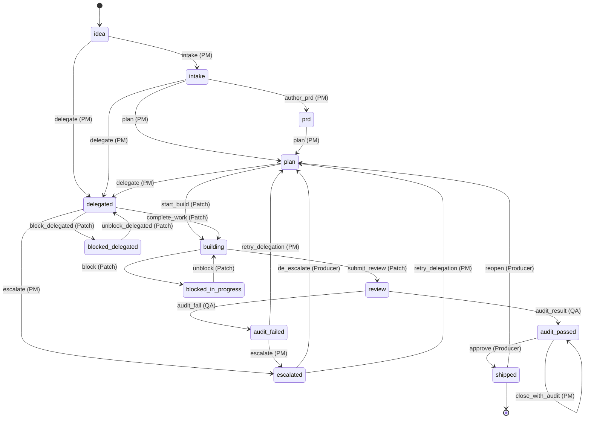
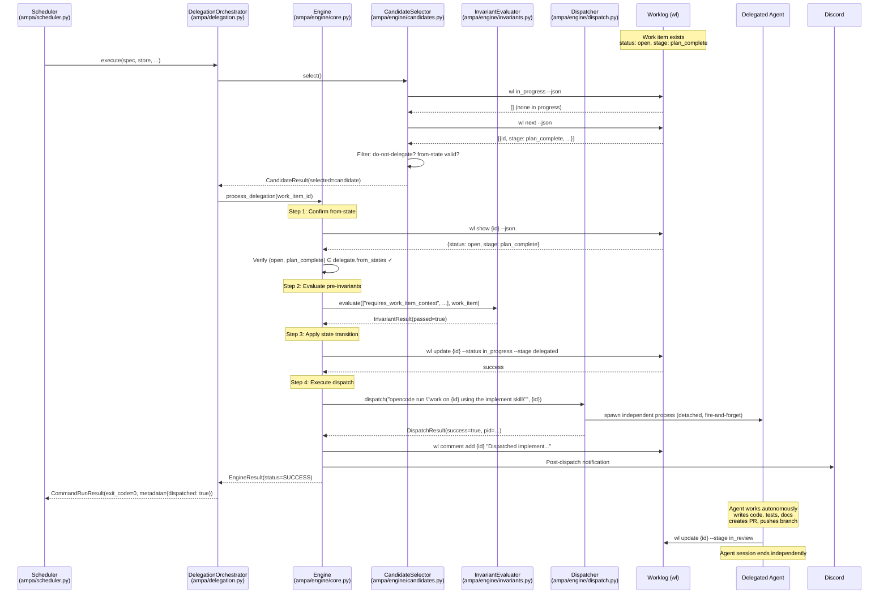
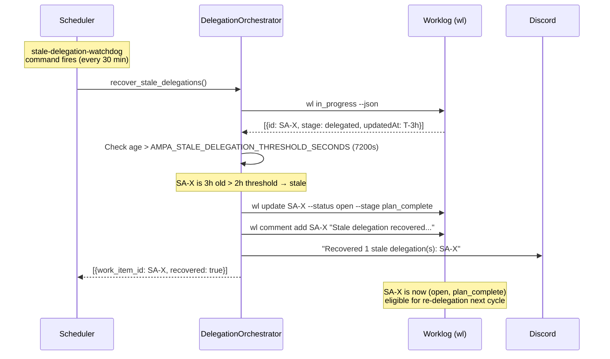

# AMPA Engine Execution Semantics & Actor Mappings

## PRD — Product Requirements Document (v2)

| Field | Value |
|---|---|
| Work Item | SA-0MM1OMHR10AAV9OQ |
| Supersedes | SA-0MLT1ENFV0CTQ1IO (`docs/workflow/engine-prd.md` v1) |
| Status | Draft |
| Author | opencode |
| Date | 2026-03-22 |
| Schema Ref | `docs/workflow/workflow-schema.json`, `docs/workflow/workflow.yaml` |

---

## 1. Overview

This PRD is the single, authoritative reference for the AMPA engine's execution semantics. It reconciles the prior engine PRD (`docs/workflow/engine-prd.md`, SA-0MLT1ENFV0CTQ1IO) with the current code structure following the delegation orchestration extraction (SA-0MLXEM41U1VIK3TB) and the scheduler–engine integration (SA-0MLX8HGUW0718XI5).

### 1.1 Purpose

Provide precise, implementation-referenced documentation for:

- **Actors & roles** — how workflow roles map to agents, humans, and runtime dispatch
- **State machine** — the complete `(status, stage)` state space and transitions
- **Delegation lifecycle** — spawn, monitor, timeout, kill, result handling
- **Audit & trace format** — structured comments, dispatch records, observability
- **Error handling & retry/backoff** — failure modes and recovery semantics
- **Configuration knobs** — environment variables, defaults, and tuning
- **Testing & validation plan** — executable test cases for CI

### 1.2 Audience

| Audience | Use |
|---|---|
| Engineering leads & implementers | Precise state-machine semantics for coding Engine transitions |
| Producers / operators | Audit format and observability for monitoring delegation runs |
| QA and SRE | Test plans and observability guidance for validation and alerting |

### 1.3 Scope

**In scope:**
- Engine execution lifecycle (Modes A and B)
- Delegation orchestration (`DelegationOrchestrator`)
- Scheduler timing loop and command dispatch
- Candidate selection, invariant evaluation, dispatch
- Audit trail and notification formats
- Error, timeout, and retry semantics
- Configuration knobs and defaults
- Executable test plan

**Out of scope:**
- Workflow descriptor schema definition (SA-0MLT1ELCS16VDQV6)
- Post-delegation audit flow (SA-0MLWQI6DC09TF7IY)
- Proposed architectural changes where scheduler only executes commands and engine owns full delegation lifecycle (SA-0MLYOP9XN1I6P8MX — acknowledged, not prescribed)

### 1.4 Delegation Pattern: Unidirectional, Fire-and-Forget

The AMPA engine uses a **unidirectional, fire-and-forget delegation** pattern:

1. Engine selects a work item via candidate selection
2. Engine delegates the work item to an agent with full context
3. Agent works autonomously — no back-and-forth with the engine
4. Agent completes independently — updates work item state on completion

The engine does not wait for or receive a return from the agent session. Completion is signaled through work item state changes.

---

## 2. Architecture

### 2.1 Module Boundaries (Post-Extraction)

Since SA-0MLXEM41U1VIK3TB and SA-0MLX8HGUW0718XI5, the system is organized into three layers:

```
┌─────────────────────────────────────────────────────┐
│  Scheduler Layer (ampa/scheduler.py)                │
│  • Timing loop (run_forever / run_once)             │
│  • Command scoring & selection (select_next)        │
│  • Command dispatch (start_command)                 │
│  • SchedulerStore persistence                       │
│  • Discord bot supervision                          │
└──────────────────────┬──────────────────────────────┘
                       │ invokes
┌──────────────────────▼──────────────────────────────┐
│  Delegation Orchestrator (ampa/delegation.py)       │
│  • Pre-flight checks (_inspect_idle_delegation)     │
│  • Idle delegation dispatch (run_idle_delegation)   │
│  • Delegation reports (run_delegation_report)       │
│  • Stale recovery (recover_stale_delegations)       │
│  • Main entry point (execute)                       │
└──────────────────────┬──────────────────────────────┘
                       │ delegates to
┌──────────────────────▼──────────────────────────────┐
│  Engine Layer (ampa/engine/)                        │
│  • core.py — Engine orchestrator (4-step lifecycle) │
│  • descriptor.py — Workflow descriptor model        │
│  • candidates.py — Candidate selection & filtering  │
│  • invariants.py — Pre/post invariant evaluation    │
│  • dispatch.py — Agent session spawning             │
│  • adapters.py — Shell/store bridges to protocols   │
└─────────────────────────────────────────────────────┘
```

### 2.2 Dependency Injection via Protocols

The engine uses runtime-checkable `Protocol` interfaces for all external dependencies. This enables testing via null/mock implementations:

| Protocol | Defined in | Production Adapter |
|---|---|---|
| `Dispatcher` | `dispatch.py:63` | `OpenCodeRunDispatcher`, `ContainerDispatcher` |
| `CandidateFetcher` | `candidates.py:29` | `ShellCandidateFetcher` (`adapters.py`) |
| `InProgressQuerier` | `candidates.py:40` | `ShellInProgressQuerier` (`adapters.py`) |
| `WorkItemFetcher` | `core.py:42` | `ShellWorkItemFetcher` (`adapters.py`) |
| `WorkItemUpdater` | `core.py:55` | `ShellWorkItemUpdater` (`adapters.py`) |
| `WorkItemCommentWriter` | `core.py:68` | `ShellCommentWriter` (`adapters.py`) |
| `DispatchRecorder` | `core.py:81` | `StoreDispatchRecorder` (`adapters.py`) |
| `NotificationSender` | `core.py:91` | `DiscordNotificationSender` (`adapters.py`) |
| `InvariantEvaluator` | `invariants.py:322` | Direct instantiation with `Invariant` objects |

Each protocol has a `Null*` default that is a no-op, used when the engine is constructed without full wiring (e.g., tests).

### 2.3 Engine Construction

The `build_engine()` factory (invoked by `Scheduler.__init__`) wires the production graph:

1. Loads `WorkflowDescriptor` from YAML via `load_descriptor()`
2. Creates shell adapters wrapping the scheduler's `run_shell` callable
3. Builds `CandidateSelector` with the fetcher and in-progress querier
4. Builds `InvariantEvaluator` with descriptor invariants
5. Creates `OpenCodeRunDispatcher` (or `ContainerDispatcher` if pool is configured)
6. Assembles `Engine` with all collaborators

---

## 3. Actors & Roles

### 3.1 Role Definitions

Roles are declared in `docs/workflow/workflow.yaml` under `metadata.roles` and loaded into `Role` dataclass instances (`descriptor.py`):

| Role | Type | Resolution | Current Agent |
|---|---|---|---|
| **Producer** | `human` | Sets `needs_producer_review: true`, sends Discord notification. Engine exits; human action is async. | Human operator |
| **PM** | `either` | AMPA scheduler agent. Handles intake, planning, delegation coordination. | AMPA scheduler (`ampa/scheduler.py`) |
| **Patch** | `agent` | Spawns independent `opencode run` session via `Dispatcher`. Session is detached from engine process. | OpenCode agent |
| **QA** | `agent` | Audit flow agent executing the `audit` skill. Out of engine scope (SA-0MLWQI6DC09TF7IY). | Audit flow agent |
| **DevOps** | `either` | CI/CD systems or human operators. | CI/CD + human |
| **TechnicalWriter** | `either` | Agent or human. Produces documentation. | OpenCode agent or human |

### 3.2 Actor Resolution Policy

When a command specifies `actor: <Role>`, the engine resolves it as follows (`core.py`, `process_delegation()` Step 4):

1. **Agent roles** (`Patch`): Dispatched via `Dispatcher.dispatch()`. The dispatch template is looked up from the command's `dispatch_map` keyed by the from-state alias. The `{id}` placeholder in the template is replaced with the work item ID.

2. **Human roles** (`Producer`): The engine sets `needs_producer_review: true` on the work item and sends a Discord notification. The engine exits immediately.

3. **Either roles** (`PM`): Resolved based on engine configuration. Currently, `PM` is always the AMPA scheduler itself.

### 3.3 Assignment Policy

- **Delegation**: Assigns to the delegated agent role via `effects.set_assignee` in the command definition.
- **Escalation**: Assigns to `Producer` via `effects.set_assignee`.
- **Completion**: The delegated agent is responsible for updating work item state and ownership on completion.

### 3.4 Dispatch Map (Actor → Shell Command)

The `delegate` command in `workflow.yaml` defines a `dispatch_map` that maps from-state aliases to shell commands:

| From State Alias | Shell Command Template | Actor |
|---|---|---|
| `idea` | `opencode run "/intake {id} do not ask questions"` | PM |
| `intake` | `opencode run "/plan {id}"` | PM |
| `plan` | `opencode run "work on {id} using the implement skill"` | Patch |

The engine resolves the from-state alias via `WorkflowDescriptor.resolve_from_state_alias()` (`descriptor.py`) and formats the template with the work item ID.

---

## 4. State Machine

### 4.1 State Dimensions

Work item state is a 2-tuple `(status, stage)`. Both dimensions are defined in `workflow.yaml`:

**Status values:** `open`, `in_progress`, `blocked`, `completed`, `closed`

**Stage values:** `idea`, `intake_complete`, `prd_complete`, `plan_complete`, `in_progress`, `in_review`, `audit_passed`, `audit_failed`, `escalated`, `done`

### 4.2 Named States

The descriptor defines named state aliases that map to `(status, stage)` tuples. These aliases are used in command `from`/`to` definitions:

| Alias | Status | Stage | Description |
|---|---|---|---|
| `idea` | `open` | `idea` | New work item, not yet triaged |
| `intake` | `open` | `intake_complete` | Intake complete, ready for planning |
| `prd` | `open` | `prd_complete` | PRD authored, ready for planning |
| `plan` | `open` | `plan_complete` | Plan complete, ready for build/delegation |
| `building` | `in_progress` | `in_progress` | Active implementation |
| `delegated` | `in_progress` | `delegated` | Delegated to an agent (AMPA) |
| `review` | `in_progress` | `in_review` | Implementation complete, under review |
| `audit_passed` | `completed` | `in_review` | Audit passed, awaiting approval |
| `audit_failed` | `in_progress` | `audit_failed` | Audit found gaps |
| `escalated` | `in_progress` | `escalated` | Escalated to Producer |
| `blocked_in_progress` | `blocked` | `in_progress` | Blocked during active work |
| `blocked_delegated` | `blocked` | `delegated` | Blocked during delegation |
| `shipped` | `closed` | `done` | Terminal state |

### 4.3 State Transition Diagram



### 4.4 Terminal States

The only terminal state is `shipped` (`closed/done`). All other states allow further transitions.

---

## 5. Delegation Lifecycle

### 5.1 Engine Dual Invocation Model

The engine supports two invocation modes, implemented as separate methods on the `Engine` class (`ampa/engine/core.py`):

| Mode | Method | Caller | Purpose |
|---|---|---|---|
| **A: Initial Dispatch** | `process_delegation(work_item_id=None)` | `DelegationOrchestrator.run_idle_delegation()` | Select and delegate a work item to an agent |
| **B: Agent Callback** | `process_transition(work_item_id, target_stage)` | Delegated agent (via engine API) | Agent requests a state transition after completing work |

### 5.2 Mode A: Initial Dispatch (4-Step Lifecycle)

`Engine.process_delegation()` implements the 4-step command execution lifecycle defined in the workflow language specification. Reference: `ampa/engine/core.py:308-641`.

#### Pre-Checks (lines 316-355)

Before entering the 4-step lifecycle, the engine checks:

- **`audit_only` mode**: If `EngineConfig.audit_only` is `True`, returns `EngineStatus.SKIPPED`.
- **`fallback_mode`**: If `hold` or `discuss-options`, returns `EngineStatus.SKIPPED`.

#### Step 1: Confirm From-State (lines 406-426)

1. Look up the `delegate` command from the workflow descriptor.
2. Resolve all valid from-states from the command's `from` list (each may be a state alias or inline `(status, stage)` tuple).
3. Read the work item's current `(status, stage)`.
4. Verify the current state matches at least one valid from-state.

**Failure**: Returns `EngineStatus.REJECTED`. No state change. Warning logged.

#### Step 2: Evaluate Pre-Invariants (lines 429-473)

1. Look up the `delegate` command's `pre` invariant list.
2. Fetch full work item data via `WorkItemFetcher`.
3. Evaluate each invariant's `logic` expression against the work item fields.

The `delegate` command defines these pre-invariants (from `workflow.yaml`):

| Invariant | Logic | Purpose |
|---|---|---|
| `requires_work_item_context` | `length(description) > 50` | Ensures sufficient context for delegation |
| `requires_acceptance_criteria` | `regex(description, "(?i)(acceptance criteria\|\\- \\[)")` | Ensures AC are present |
| `requires_stage_for_delegation` | `stage in ["idea","intake_complete","plan_complete"]` | Valid delegation stages |
| `not_do_not_delegate` | `"do-not-delegate" not in tags and "do_not_delegate" not in tags` | Respects opt-out tag |
| `no_in_progress_items` | `count(work_items, status="in_progress") == 0` | Single-concurrency constraint |

**Failure**: Returns `EngineStatus.INVARIANT_FAILED`. Writes a comment to the work item. Sends Discord notification.

#### Step 3: Apply State Transition (lines 477-519)

1. Resolve the `to` state from the command definition.
2. Determine assignee from `effects.set_assignee` (if defined).
3. Call `WorkItemUpdater.update(work_item_id, status, stage, assignee)`.

**Failure**: Retries once (per PRD Section 6.2). If retry also fails, returns `EngineStatus.UPDATE_FAILED`.

#### Step 4: Execute Dispatch (lines 521-641)

1. Resolve the from-state alias for the work item's state.
2. Check for `auto-decline` fallback mode override.
3. Look up the dispatch template from the command's `dispatch_map` keyed by the from-state alias.
4. Format the template with `{id}` → work item ID.
5. Call `Dispatcher.dispatch(command_string, work_item_id)`.
6. Record dispatch via `DispatchRecorder.record_dispatch()`.
7. Send post-dispatch notification via `NotificationSender`.

**Failure**: Returns `EngineStatus.DISPATCH_FAILED` with error details.

### 5.3 Mode B: Agent Callback

`Engine.process_transition()` handles agent-initiated state transitions. Reference: `ampa/engine/core.py:647-770`.

1. **Fetch current state** (lines 673-685): Gets work item data, extracts `(status, stage)`.
2. **Find matching command** (lines 688-700): Iterates all commands to find one whose from-states include the current state and whose to-state stage matches `target_stage`.
3. **Evaluate post-invariants** (lines 703-728): If the matching command has `post` invariants, evaluates them. On failure, writes a refusal comment and returns `INVARIANT_FAILED`.
4. **Apply transition** (lines 731-770): Calls `updater.update()`. Retries once on failure.

### 5.4 Delegation Orchestration Layer

The `DelegationOrchestrator` (`ampa/delegation.py`) sits between the scheduler and the engine, managing the full delegation flow:

#### `execute()` — Main Entry Point (lines 814-1092)

Called from `Scheduler.start_command()` when `command_type == "delegation"`. Flow:

1. Determine effective `audit_only` mode from `auto_assign_enabled` or legacy metadata
2. Call `_inspect_idle_delegation()` for pre-flight status
3. Conditionally generate and send pre-dispatch delegation report to Discord
4. Branch on inspection status:
   - `"in_progress"` → skip delegation, agents are busy
   - `"idle_no_candidate"` → skip, nothing actionable
   - `"idle_with_candidate"` → call `run_idle_delegation()`
   - Other/error → skip with fallback message
5. If dispatched, generate and send post-dispatch report to Discord
6. Return `CommandRunResult` with delegation metadata

#### `_inspect_idle_delegation()` — Pre-Flight (lines 348-396)

Lightweight check using `CandidateSelector.select()`. Returns one of:
- `"in_progress"` — agents are already working (single-concurrency block)
- `"idle_no_candidate"` — idle but nothing actionable
- `"idle_with_candidate"` — idle with a selected candidate ready to dispatch
- `"error"` — pre-flight check failed

#### `run_idle_delegation()` — Dispatch (lines 400-509)

Delegates to `Engine.process_delegation()` and converts the `EngineResult` to a legacy dict format for backward compatibility. Handles all `EngineStatus` values.

#### `recover_stale_delegations()` — Watchdog (lines 601-810)

Detects work items stuck in `(in_progress, delegated)` state beyond the stale threshold:

1. Query `wl in_progress --json`
2. Filter for `stage == "delegated"` items older than `AMPA_STALE_DELEGATION_THRESHOLD_SECONDS`
3. Reset stale items to `(open, plan_complete)` via `wl update`
4. Post `wl comment` documenting recovery
5. Send batched Discord notification

### 5.5 Delegation Sequence Diagram (Happy Path)



### 5.6 Stale Delegation Recovery Sequence



---

## 6. Candidate Selection

### 6.1 Selection Process

Candidate selection is implemented in `CandidateSelector` (`ampa/engine/candidates.py`). The `select()` method performs:

1. **Global blocker check**: If `InProgressQuerier.count_in_progress() > 0`, all delegation is blocked (single-concurrency constraint). Returns `CandidateResult` with `global_rejections` listing the in-progress items.

2. **Fetch candidates**: Calls `CandidateFetcher.fetch()` which runs `wl next --json`.

3. **Per-candidate filtering**: For each candidate, check:
   - Has a valid ID (non-empty `SA-*` identifier)
   - Not tagged `do-not-delegate` or `do_not_delegate` (`is_do_not_delegate()`)
   - Current `(status, stage)` is in the valid from-states for the `delegate` command (`is_in_valid_from_state()`)

4. **Return**: First candidate passing all filters is `selected`. Rejected candidates are recorded with reasons in `CandidateResult.rejections`.

### 6.2 Valid From-States for Delegation

The `delegate` command in `workflow.yaml` declares these from-states:

| Alias | `(status, stage)` |
|---|---|
| `idea` | `(open, idea)` |
| `intake` | `(open, intake_complete)` |
| `plan` | `(open, plan_complete)` |

Any work item not in one of these states is rejected at the candidate filtering stage.

---

## 7. Invariant Evaluation

### 7.1 Expression Language

The `InvariantEvaluator` (`ampa/engine/invariants.py`) evaluates logic expressions from the workflow descriptor against work item data. Supported expression patterns:

| Pattern | Example | Evaluator Function |
|---|---|---|
| `length(field) > N` | `length(description) > 50` | `_eval_length` |
| `regex(field, "pattern")` | `regex(description, "(?i)(acceptance criteria)")` | `_eval_regex` |
| `field in [values]` | `stage in ["idea", "intake_complete"]` | `_eval_membership` |
| `"value" not in tags` | `"do-not-delegate" not in tags` | `_eval_not_in_tags` |
| `count(collection, filter) == N` | `count(work_items, status="in_progress") == 0` | `_eval_count` |
| `X and Y` | Compound boolean AND | `_split_and_expression` |

Unrecognized expressions **fail open** (pass with a warning logged). This ensures new invariant patterns don't silently block delegation.

### 7.2 Work Item Field Extraction

`extract_work_item_fields()` normalizes `wl show --json` output into a flat dict with these keys:

| Field | Source | Type |
|---|---|---|
| `description` | `workItem.description` | `str` |
| `comments_text` | Concatenated `comments[].comment` | `str` |
| `tags` | `workItem.tags` | `list[str]` |
| `status` | `workItem.status` | `str` |
| `stage` | `workItem.stage` | `str` |
| `assignee` | `workItem.assignee` | `str` |
| `title` | `workItem.title` | `str` |
| `priority` | `workItem.priority` | `str` |
| `raw` | Original dict | `dict` |

### 7.3 Invariant Definitions (from `workflow.yaml`)

| Name | When | Logic | Description |
|---|---|---|---|
| `requires_work_item_context` | pre | `length(description) > 50` | Work item has sufficient context |
| `requires_acceptance_criteria` | pre | `regex(description, "(?i)(acceptance criteria\|\\- \\[)")` | AC section or checklist present |
| `requires_stage_for_delegation` | pre | `stage in ["idea","intake_complete","plan_complete"]` | Valid delegation entry stages |
| `not_do_not_delegate` | pre | `"do-not-delegate" not in tags and "do_not_delegate" not in tags` | Opt-out tag not present |
| `no_in_progress_items` | pre | `count(work_items, status="in_progress") == 0` | Single-concurrency gate |
| `requires_prd_link` | pre | `regex(description, "docs/.*\\.md")` | PRD linked in description |
| `requires_tests` | post | `regex(comments_text, "(?i)(tests? pass\|all checks? pass)")` | Tests confirmed passing |
| `requires_approvals` | post | `regex(comments_text, "(?i)(approved\|lgtm\|ship it)")` | Approval recorded |
| `audit_recommends_closure` | post | `regex(comments_text, "(?i)recommend.*clos")` | Audit recommends closure |
| `audit_does_not_recommend_closure` | post | `regex(comments_text, "(?i)does not recommend.*clos")` | Audit does not recommend closure |

---

## 8. Dispatch Implementations

### 8.1 Dispatcher Protocol

All dispatchers implement the `Dispatcher` protocol (`ampa/engine/dispatch.py:63`):

```python
class Dispatcher(Protocol):
    def dispatch(self, command: str, work_item_id: str) -> DispatchResult: ...
```

`DispatchResult` captures: `success`, `command`, `work_item_id`, `timestamp`, `pid`, `error`, `container_id`.

### 8.2 Production Dispatchers

#### `OpenCodeRunDispatcher` (lines 135-234)

The default production dispatcher. Spawns `opencode run "<command>"` as a fully detached subprocess:

- `start_new_session=True` (new process group)
- `stdin/stdout/stderr` → `DEVNULL`
- Returns immediately with the PID

Error handling: catches `FileNotFoundError`, `PermissionError`, `OSError` and returns a failed `DispatchResult`.

#### `ContainerDispatcher` (lines 645-822)

Pool-based Podman/Distrobox dispatcher for isolated agent sessions:

1. **Claim** a pool container from `pool-state.json`
2. **Build** command: `distrobox enter <container> -- <command>`
3. **Spawn** detached subprocess
4. **Schedule** timeout enforcement thread (SIGTERM → grace period → SIGKILL via `os.killpg`)
5. **Schedule** teardown-on-completion daemon thread (waits for process exit, then `podman stop` + `podman rm`)

Pool configuration:
- Pool prefix: `ampa-pool-`
- Pool size: 3
- Max index: 9
- State file: `$XDG_CONFIG_HOME/opencode/.worklog/ampa/pool-state.json`

#### `DryRunDispatcher` (lines 830-895)

Test dispatcher that records calls without spawning processes. Supports `fail_on` set for simulating failures.

---

## 9. Error Handling & Retry/Backoff

### 9.1 Engine-Level Error Handling

All error paths return an `EngineResult` with the appropriate `EngineStatus`:

| Status | Trigger | Engine Response | Work Item Impact |
|---|---|---|---|
| `SUCCESS` | Dispatch completed | Audit recorded, notification sent | State transitioned to `delegated` |
| `NO_CANDIDATES` | `wl next` returns empty | Idle notification sent | None |
| `REJECTED` | From-state mismatch | Warning logged | None |
| `INVARIANT_FAILED` | Pre/post invariant fails | Comment written, notification sent | None (pre) or refusal comment (post) |
| `DISPATCH_FAILED` | `opencode run` spawn fails | Error in dispatch result | State already transitioned (may need recovery) |
| `UPDATE_FAILED` | `wl update` fails twice | Error logged | Left in prior state |
| `SKIPPED` | `audit_only` or `hold` mode | Silent skip | None |
| `ERROR` | Unexpected exception | Error logged | None |

### 9.2 Retry Policy

The engine implements a **single retry** for `wl update` failures (`core.py`, Step 3 and Mode B Step 4):

- First attempt fails → retry once immediately
- Second attempt fails → return `UPDATE_FAILED`, work item left in prior state
- No exponential backoff; retries are immediate

### 9.3 Timeout & Kill Semantics

#### Scheduler-Level Command Timeout

The scheduler wraps `run_shell` with a configurable timeout (`ampa/scheduler.py`, constructor):

- Default: `AMPA_CMD_TIMEOUT_SECONDS` = 3600s (1 hour)
- On timeout: produces `CompletedProcess` with `returncode=124`, sends Discord notification

#### Container Dispatch Timeout

`ContainerDispatcher` enforces timeouts via a background thread:

- Timeout: `AMPA_CONTAINER_DISPATCH_TIMEOUT` (default 240s)
- Escalation: `SIGTERM` → grace period → `SIGKILL` via `os.killpg` (process group kill)
- Post-kill: container teardown via `podman stop` + `podman rm`
- Teardown timeout: `AMPA_CONTAINER_TEARDOWN_TIMEOUT` (default 60s)
- On teardown failure: container marked for watchdog cleanup in `pool-cleanup.json`

#### Stale Delegation Watchdog

`DelegationOrchestrator.recover_stale_delegations()` detects agent sessions that never completed:

- Threshold: `AMPA_STALE_DELEGATION_THRESHOLD_SECONDS` (default 7200s / 2 hours)
- Recovery: reset to `(open, plan_complete)` + comment + Discord notification
- Frequency: every 30 minutes (configured in scheduler store as `stale-delegation-watchdog` command)

### 9.4 Delegation Orchestrator Error Paths

`DelegationOrchestrator.execute()` handles engine results and maps them to user-facing outputs:

| Engine Status | Orchestrator Response |
|---|---|
| `SUCCESS` | Post-dispatch report to Discord, return success result |
| `NO_CANDIDATES` | Idle notification, return idle result |
| `SKIPPED` | Log skip reason, return skip result |
| `REJECTED` | Include rejection details in report |
| `INVARIANT_FAILED` | Include failed invariant names in report |
| `DISPATCH_FAILED` | Error notification to Discord |
| `ERROR` | Fallback error message |

---

## 10. Audit & Trace Format

### 10.1 Dispatch Audit Trail

The engine records every dispatch via `DispatchRecorder` (production: `StoreDispatchRecorder` wrapping `SchedulerStore.append_dispatch()`). Records are stored in an append-only log in the scheduler store (last 100 entries in `data["dispatches"]`).

Each dispatch record contains:

| Field | Source | Always Present |
|---|---|---|
| `work_item_id` | Selected candidate ID | Yes |
| `work_item_title` | Candidate title | Yes |
| `action` | Dispatch template key (intake/plan/implement) | Yes |
| `timestamp` | UTC ISO timestamp | Yes |
| `dispatch_status` | `spawned` / `failed` | Yes |
| `pid` | OS process ID | When spawned |
| `container_id` | Pool container name | When using ContainerDispatcher |
| `rejection_reasons` | List of rejected candidate summaries | When candidates rejected |
| `error` | Error message | When dispatch failed |

### 10.2 Work Item Comments

The engine writes structured comments to work items via `WorkItemCommentWriter` at these points:

| Event | Comment Content | Author |
|---|---|---|
| Pre-invariant failure | Invariant name(s) that failed + summary | `ampa-engine` |
| Post-invariant refusal | Invariant name(s) that failed + refusal explanation | `ampa-engine` |
| Stale delegation recovery | Recovery details: old state, new state, age at recovery | `ampa-scheduler` |

### 10.3 Engine Result Summary

`EngineResult.summary()` produces a pipe-delimited string for logging:

```
SUCCESS | SA-XXXXX | delegate | implement | 2026-03-22T10:00:00Z
```

### 10.4 Workflow Descriptor Audit Effects

The `delegate` command in `workflow.yaml` declares audit effects that the delegated agent should record:

| Effect | Description |
|---|---|
| `record_prompt_hash` | SHA hash of the prompt sent to the agent |
| `record_model` | Model identifier used by the agent |
| `record_response_ids` | Response IDs from the model API |
| `record_agent_id` | Identifier of the agent session |

These are recorded by the delegated agent (not the engine) as part of its work item comments.

---

## 11. Configuration Knobs

### 11.1 Engine Configuration (`EngineConfig`)

| Field | Type | Default | Description |
|---|---|---|---|
| `descriptor_path` | `str` | `docs/workflow/workflow.yaml` | Path to workflow descriptor |
| `max_concurrency` | `int` | `1` | Maximum concurrent delegations (currently enforced as single) |
| `fallback_mode` | `str` | `"hold"` | One of: `hold`, `auto-decline`, `auto-accept`, `discuss-options` |
| `audit_only` | `bool` | `False` | When true, engine skips delegation entirely |

### 11.2 Scheduler Configuration (`SchedulerConfig`)

| Field | Env Var | Default | Description |
|---|---|---|---|
| `poll_interval_seconds` | `AMPA_SCHEDULER_POLL_INTERVAL_SECONDS` | `5` | Sleep time between scheduler iterations |
| `global_min_interval_seconds` | `AMPA_SCHEDULER_GLOBAL_MIN_INTERVAL_SECONDS` | `60` | Minimum seconds between any two command starts |
| `priority_weight` | `AMPA_SCHEDULER_PRIORITY_WEIGHT` | `0.1` | Weight factor in command scoring |
| `store_path` | (computed) | `<cwd>/.worklog/ampa/scheduler_store.json` | Path to JSON store |
| `llm_healthcheck_url` | `AMPA_LLM_HEALTHCHECK_URL` | `http://localhost:8000/health` | URL for LLM health probe |
| `max_run_history` | `AMPA_SCHEDULER_MAX_RUN_HISTORY` | `50` | Max entries in per-command run history |
| `container_dispatch_timeout_seconds` | `AMPA_CONTAINER_DISPATCH_TIMEOUT` | `240` | Timeout for container dispatches |

### 11.3 Timeout & Recovery Configuration

| Env Var | Default | Description |
|---|---|---|
| `AMPA_CMD_TIMEOUT_SECONDS` | `3600` (1h) | Scheduler-level command timeout |
| `AMPA_STALE_DELEGATION_THRESHOLD_SECONDS` | `7200` (2h) | Threshold before a delegation is considered stale |
| `AMPA_CONTAINER_DISPATCH_TIMEOUT` | `240` (4m) | Container dispatch timeout |
| `AMPA_CONTAINER_TEARDOWN_TIMEOUT` | `60` (1m) | Container teardown timeout |

### 11.4 Scheduler Store Commands

The scheduler store (`scheduler_store.json`) defines scheduled commands. Key delegation-related commands:

| Command ID | Type | Frequency | Purpose |
|---|---|---|---|
| `delegation` | `delegation` | 2 min | Main delegation cycle |
| `wl-triage-audit` | `triage-audit` | 2 min | Audit poller for completed work |
| `stale-delegation-watchdog` | (auto-registered) | 30 min | Stale delegation recovery |
| `wl-in_progress` | `shell` | 1 min | In-progress status report |
| `wl-stats` | `shell` | 10 min | Stats report |

---

## 12. Schema-to-Behaviour Mapping

This section addresses the gap identified in the prior PRD audit (SA-0MLT1ENFV0CTQ1IO): no itemized mapping proving every engine behaviour is expressible in the workflow schema.

### 12.1 Command-to-Code Mapping

| Workflow Command | Actor | Engine Code Path | Delegation Module | Description |
|---|---|---|---|---|
| `intake` | PM | `process_delegation()` Step 4, dispatch_map["idea"] | `run_idle_delegation()` | Spawn `/intake {id}` |
| `author_prd` | PM | Not engine-driven | N/A | Manual or PM-assisted PRD authoring |
| `plan` | PM | `process_delegation()` Step 4, dispatch_map["intake"] | `run_idle_delegation()` | Spawn `/plan {id}` |
| `start_build` | Patch | Not engine-driven | N/A | Manual developer pickup |
| `delegate` | PM | `process_delegation()` Steps 1-4 | `execute()` → `run_idle_delegation()` | Full delegation lifecycle |
| `complete_work` | Patch | `process_transition(id, "in_progress")` | N/A (agent-initiated) | Agent marks work complete |
| `block` | Patch | Not engine-driven | N/A | `wl update --status blocked` |
| `block_delegated` | Patch | Not engine-driven | N/A | `wl update --status blocked --stage delegated` |
| `unblock` | Patch | Not engine-driven | N/A | `wl update --status in_progress` |
| `unblock_delegated` | Patch | Not engine-driven | N/A | `wl update --status in_progress --stage delegated` |
| `submit_review` | Patch | `process_transition(id, "in_review")` | N/A (agent-initiated) | Agent pushes branch, creates PR |
| `audit_result` | QA | Audit flow (SA-0MLWQI6DC09TF7IY) | N/A | Audit passes |
| `audit_fail` | QA | Audit flow (SA-0MLWQI6DC09TF7IY) | N/A | Audit finds gaps |
| `close_with_audit` | PM | Audit flow (SA-0MLWQI6DC09TF7IY) | N/A | Auto-close with passing audit |
| `escalate` | PM | `process_transition(id, "escalated")` | N/A | Escalate to Producer |
| `retry_delegation` | PM | `process_transition(id, "plan_complete")` | N/A | Re-enter delegation cycle |
| `de_escalate` | Producer | Not engine-driven | N/A | Human resolves escalation |
| `approve` | Producer | Not engine-driven | N/A | Human merges PR, confirms |
| `reopen` | Producer | Not engine-driven | N/A | Re-plan closed item |

### 12.2 Invariant-to-Code Mapping

| Invariant | Logic | Evaluator Function | Code Reference |
|---|---|---|---|
| `requires_work_item_context` | `length(description) > 50` | `_eval_length` | `invariants.py:120` |
| `requires_acceptance_criteria` | `regex(...)` | `_eval_regex` | `invariants.py:145` |
| `requires_stage_for_delegation` | `stage in [...]` | `_eval_membership` | `invariants.py:180` |
| `not_do_not_delegate` | `"..." not in tags` | `_eval_not_in_tags` | `invariants.py:210` |
| `no_in_progress_items` | `count(...)` | `_eval_count` | `invariants.py:240` |
| `requires_prd_link` | `regex(...)` | `_eval_regex` | `invariants.py:145` |
| `requires_tests` | `regex(...)` | `_eval_regex` | `invariants.py:145` |
| `requires_approvals` | `regex(...)` | `_eval_regex` | `invariants.py:145` |
| `audit_recommends_closure` | `regex(...)` | `_eval_regex` | `invariants.py:145` |
| `audit_does_not_recommend_closure` | `regex(...)` | `_eval_regex` | `invariants.py:145` |

### 12.3 State Alias-to-Code Mapping

| State Alias | `(status, stage)` | Descriptor (`workflow.yaml`) | Engine Resolution (`descriptor.py:resolve_alias`) |
|---|---|---|---|
| `idea` | `(open, idea)` | `states.idea` | `StateTuple("open", "idea")` |
| `intake` | `(open, intake_complete)` | `states.intake` | `StateTuple("open", "intake_complete")` |
| `prd` | `(open, prd_complete)` | `states.prd` | `StateTuple("open", "prd_complete")` |
| `plan` | `(open, plan_complete)` | `states.plan` | `StateTuple("open", "plan_complete")` |
| `building` | `(in_progress, in_progress)` | `states.building` | `StateTuple("in_progress", "in_progress")` |
| `delegated` | `(in_progress, delegated)` | `states.delegated` | `StateTuple("in_progress", "delegated")` |
| `review` | `(in_progress, in_review)` | `states.review` | `StateTuple("in_progress", "in_review")` |
| `audit_passed` | `(completed, in_review)` | `states.audit_passed` | `StateTuple("completed", "in_review")` |
| `audit_failed` | `(in_progress, audit_failed)` | `states.audit_failed` | `StateTuple("in_progress", "audit_failed")` |
| `escalated` | `(in_progress, escalated)` | `states.escalated` | `StateTuple("in_progress", "escalated")` |
| `blocked_in_progress` | `(blocked, in_progress)` | `states.blocked_in_progress` | `StateTuple("blocked", "in_progress")` |
| `blocked_delegated` | `(blocked, delegated)` | `states.blocked_delegated` | `StateTuple("blocked", "delegated")` |
| `shipped` | `(closed, done)` | `states.shipped` | `StateTuple("closed", "done")` |

---

## 13. Testing & Validation Plan

The following test cases are designed to be executable against the current implementation. They validate the three key behaviors specified in the acceptance criteria: idle delegation, successful dispatch, and stale delegation recovery.

**Running the tests:** Save any test case to a file (e.g. `tests/test_engine_prd.py`) and run:

```bash
pytest tests/test_engine_prd.py -v
```

**Shared test helpers** (include at the top of the test file):

```python
"""Shared fixtures and helpers for engine PRD test cases.

Place this block at the top of the test file, before any test functions.
All test cases below depend on these imports and helpers.
"""
import json
import os
import pytest
from datetime import datetime, timezone, timedelta
from unittest.mock import MagicMock

from ampa.engine.core import Engine, EngineConfig, EngineStatus
from ampa.engine.candidates import CandidateSelector
from ampa.engine.descriptor import load_descriptor
from ampa.engine.dispatch import DryRunDispatcher
from ampa.engine.invariants import InvariantEvaluator


# Path to the workflow descriptor — adjust if running from a different CWD
DESCRIPTOR_PATH = "docs/workflow/workflow.yaml"


def load_test_descriptor():
    """Load the production workflow descriptor for use in tests."""
    return load_descriptor(DESCRIPTOR_PATH)


def build_invariant_evaluator(descriptor, querier=None):
    """Build an InvariantEvaluator from the descriptor's invariant definitions."""
    return InvariantEvaluator(
        invariants=descriptor.invariants,
        querier=querier,
    )
```

### Test Case 1: Idle Delegation — No Candidates Available

**Objective:** Verify the engine correctly handles the case where no actionable work items exist.

**Preconditions:**
- No work items with status `in_progress`
- No work items in states `(open, idea)`, `(open, intake_complete)`, or `(open, plan_complete)`

**Steps:**

```python
def test_idle_delegation_no_candidates():
    """Engine returns NO_CANDIDATES when wl next yields nothing."""

    # Arrange: CandidateFetcher returns empty list
    class EmptyFetcher:
        def fetch(self):
            return []

    class ZeroInProgress:
        def count_in_progress(self):
            return 0

    descriptor = load_test_descriptor()
    selector = CandidateSelector(
        descriptor=descriptor,
        fetcher=EmptyFetcher(),
        in_progress_querier=ZeroInProgress(),
        command_name="delegate",
    )
    dispatcher = DryRunDispatcher()
    engine = Engine(
        descriptor=descriptor,
        dispatcher=dispatcher,
        candidate_selector=selector,
        invariant_evaluator=build_invariant_evaluator(descriptor),
        config=EngineConfig(descriptor_path=DESCRIPTOR_PATH),
    )

    # Act
    result = engine.process_delegation()

    # Assert
    assert result.status == EngineStatus.NO_CANDIDATES
    assert not result.success
    assert len(dispatcher.calls) == 0  # Nothing dispatched
```

**Expected Result:** `EngineResult.status == NO_CANDIDATES`, no dispatch calls recorded.

---

### Test Case 2: Successful Dispatch — Plan Complete Item Delegated

**Objective:** Verify end-to-end delegation of a `plan_complete` work item through the engine's 4-step lifecycle.

**Preconditions:**
- One work item exists in state `(open, plan_complete)` with sufficient description and acceptance criteria
- No in-progress work items

**Steps:**

```python
def test_successful_dispatch_plan_complete():
    """Engine dispatches a plan_complete item via the implement template."""

    # Arrange: One candidate in plan_complete state
    candidate_data = {
        "id": "SA-TEST001",
        "title": "Test work item",
        "status": "open",
        "stage": "plan_complete",
        "priority": "high",
        "tags": [],
        "description": "Sufficient description with acceptance criteria.\n"
                       "## Acceptance Criteria\n- [ ] Feature works",
    }

    class SingleCandidateFetcher:
        def fetch(self):
            return [candidate_data]

    class ZeroInProgress:
        def count_in_progress(self):
            return 0

    class StubWorkItemFetcher:
        def fetch(self, work_item_id):
            return {"workItem": candidate_data, "comments": []}

    class TrackingUpdater:
        def __init__(self):
            self.calls = []
        def update(self, work_item_id, status, stage, assignee=None):
            self.calls.append((work_item_id, status, stage, assignee))
            return True

    descriptor = load_test_descriptor()
    selector = CandidateSelector(
        descriptor=descriptor,
        fetcher=SingleCandidateFetcher(),
        in_progress_querier=ZeroInProgress(),
        command_name="delegate",
    )
    dispatcher = DryRunDispatcher()
    updater = TrackingUpdater()

    engine = Engine(
        descriptor=descriptor,
        dispatcher=dispatcher,
        candidate_selector=selector,
        invariant_evaluator=build_invariant_evaluator(descriptor),
        fetcher=StubWorkItemFetcher(),
        updater=updater,
        config=EngineConfig(descriptor_path=DESCRIPTOR_PATH),
    )

    # Act
    result = engine.process_delegation()

    # Assert
    assert result.status == EngineStatus.SUCCESS
    assert result.success
    assert result.work_item_id == "SA-TEST001"
    assert result.action == "implement"

    # Verify state transition was applied
    assert len(updater.calls) == 1
    wid, status, stage, assignee = updater.calls[0]
    assert wid == "SA-TEST001"
    assert status == "in_progress"
    assert stage == "delegated"

    # Verify dispatch was called with implement template
    assert len(dispatcher.calls) == 1
    cmd, dispatch_wid = dispatcher.calls[0]
    assert dispatch_wid == "SA-TEST001"
    assert "work on SA-TEST001 using the implement skill" in cmd
```

**Expected Result:** `EngineResult.status == SUCCESS`, state transitioned to `(in_progress, delegated)`, dispatch called with implement command template.

---

### Test Case 3: Stale Delegation Recovery

**Objective:** Verify that the stale delegation watchdog correctly identifies and recovers stuck delegations.

**Preconditions:**
- One work item in state `(in_progress, delegated)` with `updatedAt` older than `AMPA_STALE_DELEGATION_THRESHOLD_SECONDS`

**Steps:**

```python
def test_stale_delegation_recovery():
    """Watchdog resets items stuck in delegated state past threshold."""
    from ampa.delegation import DelegationOrchestrator

    # Arrange: Mock a stale delegated item (3 hours old, threshold 2 hours)
    stale_time = (datetime.now(timezone.utc) - timedelta(hours=3)).isoformat()
    in_progress_output = json.dumps([
        {
            "id": "SA-STALE01",
            "title": "Stale item",
            "status": "in-progress",
            "stage": "delegated",
            "updatedAt": stale_time,
            "priority": "high",
            "tags": [],
        }
    ])

    shell_calls = []
    def mock_shell(cmd, **kwargs):
        shell_calls.append(cmd)
        if "wl in_progress" in " ".join(cmd):
            return MagicMock(
                returncode=0,
                stdout=in_progress_output,
            )
        # wl update and wl comment calls succeed
        return MagicMock(returncode=0, stdout="{}")

    os.environ["AMPA_STALE_DELEGATION_THRESHOLD_SECONDS"] = "7200"

    store = MagicMock()
    orchestrator = DelegationOrchestrator(
        store=store,
        run_shell=mock_shell,
        command_cwd="/test",
        engine=MagicMock(),
        candidate_selector=MagicMock(),
    )

    # Act
    recovered = orchestrator.recover_stale_delegations()

    # Assert
    assert len(recovered) == 1
    assert recovered[0]["work_item_id"] == "SA-STALE01"

    # Verify wl update was called to reset state
    update_calls = [c for c in shell_calls if "wl update" in " ".join(c)]
    assert len(update_calls) >= 1
    update_cmd = " ".join(update_calls[0])
    assert "SA-STALE01" in update_cmd
    assert "plan_complete" in update_cmd or "open" in update_cmd

    # Verify recovery comment was posted
    comment_calls = [c for c in shell_calls if "wl comment" in " ".join(c)]
    assert len(comment_calls) >= 1
```

**Expected Result:** Stale item reset to `(open, plan_complete)`, recovery comment posted, recovery info returned.

---

### Test Case 4: Single-Concurrency Enforcement (Bonus)

**Objective:** Verify that delegation is blocked when another work item is already in progress.

```python
def test_single_concurrency_blocks_delegation():
    """CandidateSelector blocks delegation when items are in progress."""

    class NonEmptyFetcher:
        def fetch(self):
            return [{"id": "SA-CAND01", "status": "open", "stage": "plan_complete",
                      "title": "Candidate", "priority": "high", "tags": []}]

    class OneInProgress:
        def count_in_progress(self):
            return 1

    descriptor = load_test_descriptor()
    selector = CandidateSelector(
        descriptor=descriptor,
        fetcher=NonEmptyFetcher(),
        in_progress_querier=OneInProgress(),
        command_name="delegate",
    )

    result = selector.select()

    assert result.selected is None
    assert len(result.global_rejections) > 0
    assert "in_progress" in result.global_rejections[0].lower() \
        or "in-progress" in result.global_rejections[0].lower()
```

**Expected Result:** No candidate selected, global rejection reason mentions in-progress items.

---

## 14. Rollout Notes

### 14.1 Changes from Prior PRD (v1)

This PRD (v2) supersedes `docs/workflow/engine-prd.md` (SA-0MLT1ENFV0CTQ1IO) with the following changes:

| Area | v1 State | v2 State | Reason |
|---|---|---|---|
| Module structure | Scheduler + Engine (2-layer) | Scheduler + DelegationOrchestrator + Engine (3-layer) | Delegation extracted (SA-0MLXEM41U1VIK3TB) |
| Entry point | Scheduler → Engine directly | Scheduler → `DelegationOrchestrator.execute()` → `Engine.process_delegation()` | Integration change (SA-0MLX8HGUW0718XI5) |
| Stale recovery | Mentioned as open question | Fully documented: `recover_stale_delegations()`, threshold, Discord notification | Implemented (SA-0MLXJCNMR0OQD7Z5) |
| Container dispatch | Not covered | Full documentation: pool management, timeout, teardown | Implemented in `dispatch.py` |
| Schema mapping | Partial gap noted | Complete command-to-code, invariant-to-code, and state-to-code mappings | Gap addressed (Section 12) |
| Test plan | Out of scope | 4 executable test cases included | Acceptance criteria met |

### 14.2 Compatibility Notes

- No production code changes are required by this PRD
- The prior PRD (`docs/workflow/engine-prd.md`) remains in the repository as historical reference; this document supersedes it
- Audit comment format is backward-compatible with existing worklog conventions
- Workflow descriptor (`workflow.yaml`) is unchanged

### 14.3 Future Directions (Acknowledged, Not Prescribed)

- **SA-0MLYOP9XN1I6P8MX**: Proposes that the scheduler should only execute commands while the engine owns the full delegation lifecycle. This would collapse the DelegationOrchestrator layer into the engine. This PRD documents the current 3-layer architecture without prescribing this change.
- **SA-0MLYEOF5J1CXPAJV**: Descriptor-driven audit command handlers depend on audit format decisions documented in this PRD (Section 10).
- **Concurrent delegation**: The current single-concurrency constraint (`max_concurrency=1`) is enforced by the `no_in_progress_items` invariant. Future versions may support configurable concurrency.

---

## Appendix A: Code Reference Index

| File | Key Classes/Functions | Line References |
|---|---|---|
| `ampa/engine/core.py` | `Engine`, `EngineResult`, `EngineStatus`, `EngineConfig`, `process_delegation()`, `process_transition()` | Engine:241, process_delegation:308, process_transition:647 |
| `ampa/engine/descriptor.py` | `WorkflowDescriptor`, `StateTuple`, `Command`, `Invariant`, `Role`, `load_descriptor()` | WorkflowDescriptor:~200, load_descriptor:~450 |
| `ampa/engine/candidates.py` | `CandidateSelector`, `WorkItemCandidate`, `CandidateResult`, `is_do_not_delegate()` | CandidateSelector:~300, select:~350 |
| `ampa/engine/invariants.py` | `InvariantEvaluator`, `evaluate_logic()`, `extract_work_item_fields()` | InvariantEvaluator:322, evaluate_logic:~280 |
| `ampa/engine/dispatch.py` | `Dispatcher`, `OpenCodeRunDispatcher`, `ContainerDispatcher`, `DryRunDispatcher`, `DispatchResult` | Dispatcher:63, OpenCodeRunDispatcher:135, ContainerDispatcher:645, DryRunDispatcher:830 |
| `ampa/engine/adapters.py` | `ShellCandidateFetcher`, `ShellWorkItemFetcher`, `ShellWorkItemUpdater`, `ShellCommentWriter`, `StoreDispatchRecorder`, `DiscordNotificationSender` | Various (416 lines total) |
| `ampa/delegation.py` | `DelegationOrchestrator`, `execute()`, `run_idle_delegation()`, `recover_stale_delegations()`, `run_delegation_report()` | DelegationOrchestrator:280, execute:814, run_idle_delegation:400, recover_stale_delegations:601 |
| `ampa/scheduler.py` | `Scheduler`, `select_next()`, `start_command()`, `run_forever()`, `run_once()` | Scheduler:88, select_next:305, start_command:364, run_forever:782 |
| `ampa/scheduler_types.py` | `CommandSpec`, `SchedulerConfig`, `RunResult`, `CommandRunResult` | CommandSpec:83, SchedulerConfig:124 |
| `ampa/scheduler_store.py` | `SchedulerStore` | SchedulerStore:24 |
| `docs/workflow/workflow.yaml` | Workflow descriptor (states, commands, invariants, roles) | 449 lines |
| `docs/workflow/workflow-schema.json` | JSON Schema for descriptor validation | N/A |

---

## Appendix B: Related Work Items

| ID | Title | Status | Relationship |
|---|---|---|---|
| SA-0MLT1ENFV0CTQ1IO | PRD: AMPA engine execution semantics (v1) | Completed | Superseded by this PRD |
| SA-0MLR5LBFP1IZ8VLL | Define AMPA delegation & management workflow | Completed | Parent design history |
| SA-0MLPYRLRY0ODG6YH | AMPA unidirectional delegation, audit, lifecycle | Completed | Foundational lifecycle decisions |
| SA-0MLX8HGUW0718XI5 | Scheduler integration: replace hard-coded delegation | Completed | Scheduler/engine integration |
| SA-0MLXEM41U1VIK3TB | Extract delegation orchestration into delegation.py | Completed | Delegation extraction |
| SA-0MLX8GXHI0L3VBY0 | Engine core orchestrator with dual invocation | Completed | Engine invocation model |
| SA-0MLXJCNMR0OQD7Z5 | Stale delegation watchdog | Completed | Stale recovery implementation |
| SA-0MLYEOF5J1CXPAJV | Implement descriptor-driven audit command handlers | Open | Downstream: depends on this PRD |
| SA-0MLYOP9XN1I6P8MX | Revisit delegation architecture | Open (idea) | Acknowledged future direction |
