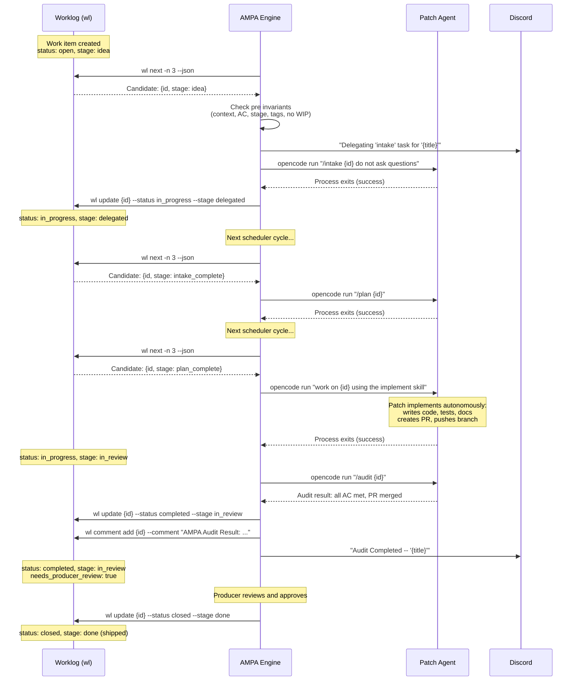
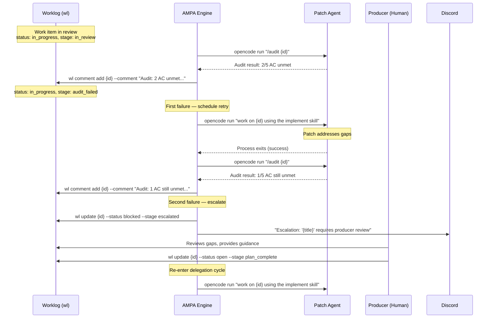
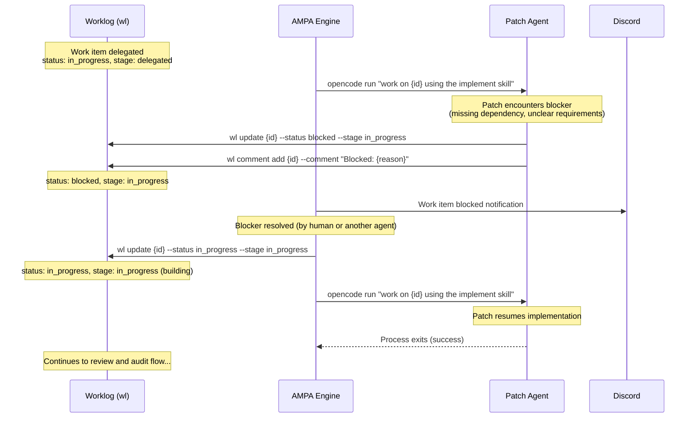

# AMPA Engine Execution Semantics & Delegation Lifecycle

## PRD — Product Requirements Document

| Field | Value |
|---|---|
| Work Item | SA-0MLT1ENFV0CTQ1IO |
| Parent | SA-0MLR5LBFP1IZ8VLL (Define AMPA delegation & management workflow) |
| Status | Draft |
| Author | opencode |
| Date | 2026-02-19 |
| Schema Ref | docs/workflow/workflow-schema.json, docs/workflow/workflow.yaml (SA-0MLT1ELCS16VDQV6) |

---

## 1. Introduction

This document describes how the AMPA engine consumes a workflow descriptor (as defined in `docs/workflow/workflow.yaml` / `docs/workflow/workflow.json`) to drive agent delegation and work item lifecycle management. It formalizes the behavior currently implemented in `scheduler.py` and maps it to the workflow descriptor schema.

### 1.1 Delegation Pattern: Unidirectional

The AMPA engine uses a **unidirectional delegation** pattern:

1. **AMPA selects** a work item via `wl next` and evaluates delegation preconditions.
2. **AMPA delegates** the work item to a Patch agent with full context (description, acceptance criteria, comments).
3. **Patch works autonomously** using the `implement` skill — no back-and-forth conversation.
4. **Patch reports completion** by returning from the `opencode run` invocation.
5. **AMPA audits** the result using the `audit` skill.
6. **AMPA closes or escalates** based on the audit outcome.

This pattern avoids the complexity of bidirectional conversation protocols. Patch has all required context from the work item and its comments at delegation time.

### 1.2 Scope

This PRD covers:
- How the engine loads and validates a workflow descriptor
- How commands are executed against work items
- How roles are resolved to concrete agents or humans
- The complete delegation lifecycle (select, delegate, implement, audit, close/escalate)
- Error handling and recovery
- Observability and audit trail

Out of scope:
- The workflow descriptor schema itself (covered in SA-0MLT1ELCS16VDQV6)
- Detailed delegation flow examples (covered in SA-0MLT1EPPK1HRBTPG)
- Test specifications (covered in SA-0MLT1ES320XPRCU8)

---

## 2. Engine Architecture Overview

### 2.1 Components

```
+------------------+     +---------------------+     +------------------+
|                  |     |                     |     |                  |
|  Workflow        |---->|  AMPA Engine        |---->|  Work Item Store |
|  Descriptor      |     |  (scheduler.py)     |     |  (Worklog / wl)  |
|  (workflow.json) |     |                     |     |                  |
+------------------+     +----------+----------+     +------------------+
                                    |
                         +----------+----------+
                         |                     |
                    +----v----+          +-----v-----+
                    |  Agent  |          | Notification|
                    | Runtime |          |  System     |
                    | (opencode run)     | (Discord)   |
                    +---------+          +-----------+
```

The engine operates as a **scheduler loop** that periodically:

1. Loads the workflow descriptor from `workflow.json`.
2. Queries the work item store (`wl`) for current state.
3. Determines which commands are available given the current state.
4. Executes commands by resolving actors to agents and invoking them.
5. Records transitions and audit details as work item comments.

### 2.2 Workflow Descriptor Loading

The engine loads the workflow descriptor at startup and validates it against `docs/workflow/workflow-schema.json`. The descriptor provides:

- **Status and stage dimensions**: The valid values for work item `status` and `stage` fields.
- **State aliases**: Friendly names for `(status, stage)` tuples used in command definitions.
- **Commands**: Named actions with `from`/`to` state transitions, actor roles, invariants, inputs, and effects.
- **Invariants**: Named boolean rules checked before (`pre`) and after (`post`) command execution.
- **Roles**: Actor identifiers mapped to concrete agents or humans by the engine's actor resolution policy.

### 2.3 State Management

Work item state is the tuple `(status, stage)`. The engine does not maintain its own state store — it reads from and writes to the Worklog via `wl` CLI commands. This ensures the Worklog remains the single source of truth.

State transitions are atomic: `wl update <id> --status <new_status> --stage <new_stage>`.

---

## 3. Actor Resolution

### 3.1 Role-to-Actor Mapping

The workflow descriptor declares roles in `metadata.roles`. Each role has a `type` field indicating whether it is typically filled by a human, an agent, or either:

| Role | Type | Current Resolution |
|---|---|---|
| **Producer** | `human` | Human operator. Cannot be automated. Gates approval and escalation review. |
| **PM** | `either` | AMPA scheduler agent. Handles intake, planning, delegation, and audit coordination. |
| **Patch** | `agent` | OpenCode agent spawned via `opencode run`. Implements delegated work autonomously. |
| **QA** | `agent` | AMPA scheduler executing the `audit` skill. Verifies acceptance criteria. |
| **DevOps** | `either` | CI/CD systems or human operators. Handles deployment and infrastructure. |
| **TechnicalWriter** | `either` | Agent or human. Produces documentation. |

### 3.2 Resolution Policy

When a command specifies `actor: <Role>`, the engine resolves the role as follows:

1. **Agent roles** (`Patch`, `QA`): The engine spawns an `opencode run` session with the appropriate skill/command. The agent is given full work item context.
2. **Human roles** (`Producer`): The engine sets `needs_producer_review: true` on the work item and sends a Discord notification. The engine pauses and waits for human action.
3. **Either roles** (`PM`, `DevOps`, `TechnicalWriter`): Resolved based on engine configuration. In the current AMPA implementation, `PM` is always the AMPA scheduler itself.

### 3.3 Assignment Policy

Per the workflow-language.md specification:

- When a work item enters a new state, the engine assigns the item per its controller policy.
- While a command runs, temporary ownership belongs to the command's `actor` role.
- On success or failure, ownership returns per the engine's policy and the audit comment is appended.

In practice (scheduler.py):
- Delegation (`delegate` command): assigns to `Patch` via `effects.set_assignee`.
- Audit completion (`close_with_audit`): sets `needs_producer_review: true` for Producer attention.
- Escalation (`escalate`): assigns to `Producer` via `effects.set_assignee`.

---

## 4. Command Execution Lifecycle

Per workflow-language.md Section "Execution Semantics", each command attempt follows these 6 steps:

### Step 1: Confirm From State

The engine reads the work item's current `(status, stage)` tuple and checks whether it matches any entry in the command's `from` list. If the tuple is expressed as a state alias, the engine resolves it via the `states` map.

**Failure behavior**: If the work item is not in a valid `from` state, the command is rejected. No state change occurs. The engine logs a warning.

### Step 2: Evaluate Pre Invariants

Each invariant name in the command's `pre` list is looked up in the `invariants` array and its `logic` expression is evaluated against the work item's current data (description, comments, tags, metadata).

**Failure behavior**: If any pre invariant fails, the command is aborted. No state change occurs. The engine records the failure as a work item comment and may notify via Discord.

### Step 3: Execute Command Logic

The engine resolves the `actor` role to a concrete agent or human and invokes the command:

- **For agent actors**: Spawns `opencode run` with the appropriate command string (determined by stage-to-action mapping, see Section 5.2).
- **For human actors**: Sets flags on the work item and waits for human action.

The command logic itself is outside the workflow descriptor — it is the agent's autonomous work or the human's decision.

### Step 4: Apply State Transition

On successful completion of command logic, the engine writes the `to` state tuple to the work item:
```
wl update <id> --status <to.status> --stage <to.stage>
```

### Step 5: Evaluate Post Invariants

Each invariant name in the command's `post` list is evaluated against the updated work item state.

**Failure behavior**: If any post invariant fails, the engine **rolls back** to the prior state tuple and reports the failure. The rollback is recorded in the work item comments.

### Step 6: Record Audit Comment

The engine appends a comment to the work item recording:
- Command name
- Actor role and resolved agent
- Timestamp
- Outcome (success/failure)
- For AI-driven commands: prompt reference (or hash), model, response IDs (per `effects.audit` configuration)

```
wl comment add <id> --comment "<audit details>" --author "ampa-scheduler"
```

### 4.1 Command-to-Engine Behavior Mapping

The following table maps each workflow command to its engine behavior:

| Command | Actor | Engine Action | scheduler.py Mapping |
|---|---|---|---|
| `intake` | PM | `opencode run "/intake {id} do not ask questions"` | `_run_idle_delegation` (stage=idea) |
| `author_prd` | PM | PM drafts PRD, links to work item | Manual or AMPA-assisted |
| `plan` | PM | `opencode run "/plan {id}"` | `_run_idle_delegation` (stage=intake_complete) |
| `start_build` | Patch | Developer picks up work manually | N/A (manual path) |
| `delegate` | PM | `opencode run "work on {id} using the implement skill"` | `_run_idle_delegation` (stage=plan_complete) |
| `complete_work` | Patch | Patch returns from `opencode run` | Implicit on process exit |
| `block` | Patch | `wl update {id} --status blocked` | Agent or manual |
| `block_delegated` | Patch | `wl update {id} --status blocked --stage delegated` | Agent or manual |
| `unblock` | Patch | `wl update {id} --status in_progress` | Agent or manual |
| `unblock_delegated` | Patch | `wl update {id} --status in_progress --stage delegated` | Agent or manual |
| `submit_review` | Patch | Push branch, create PR | Agent workflow |
| `audit_result` | QA | `opencode run "/audit {id}"` → passes | `_run_triage_audit` |
| `audit_fail` | QA | `opencode run "/audit {id}"` → finds gaps | `_run_triage_audit` |
| `close_with_audit` | PM | `wl update {id} --status completed --stage in_review` | `_run_triage_audit` auto-completion |
| `escalate` | PM | Set `needs_producer_review`, notify Discord | Manual escalation |
| `approve` | Producer | Human merges PR, confirms | Manual human step |
| `retry_delegation` | PM | Re-delegate after fixing gaps | `_run_idle_delegation` re-entry |
| `de_escalate` | Producer | Human resolves escalation | Manual human step |
| `reopen` | Producer | Re-plan closed item | Manual human step |

---

## 5. Delegation Lifecycle

### 5.1 Delegation Preconditions

Before the engine can execute the `delegate` command, all of the following must be true (matching the pre invariants defined in the schema):

1. **requires_work_item_context**: Description length > 100 characters (sufficient context for autonomous work).
2. **requires_acceptance_criteria**: Description contains acceptance criteria (checkbox list or section header).
3. **requires_stage_for_delegation**: Work item stage is one of `idea`, `intake_complete`, or `plan_complete`.
4. **not_do_not_delegate**: Work item is not tagged `do-not-delegate` or `do_not_delegate`.
5. **no_in_progress_items**: No other work items have status `in_progress` (single-concurrency constraint).

Additionally, the engine checks (outside invariant system):
- `wl next` returns at least one candidate.
- Fallback mode is not `hold`.
- `audit_only` mode is not enabled.

### 5.2 Stage-to-Action Mapping

The delegation command determines which `opencode run` invocation to use based on the work item's current stage:

| Current Stage | Action | Shell Command |
|---|---|---|
| `idea` | `intake` | `opencode run "/intake {id} do not ask questions"` |
| `intake_complete` | `plan` | `opencode run "/plan {id}"` |
| `plan_complete` | `implement` | `opencode run "work on {id} using the implement skill"` |

The action label can be overridden by the fallback mode configuration:
- `auto-decline` → action becomes `decline`
- `auto-accept` → action becomes `accept`
- `hold` → delegation is skipped entirely

### 5.3 Delegation Dispatch

When all preconditions pass:

1. Engine selects the top candidate from `wl next -n 3`.
2. Engine determines the action from the stage-to-action mapping.
3. Engine sends a pre-dispatch Discord notification: `"Delegating '{action}' task for '{title}' ({id})"`.
4. Engine spawns `opencode run` with the appropriate command.
5. Engine waits for process completion (with timeout).
6. Engine records the dispatch in its append-only audit trail (`store.append_dispatch`).
7. Engine sends a post-dispatch report via Discord.

### 5.4 Post-Delegation Audit

After Patch completes work and the item reaches `in_review` state:

1. Engine runs `opencode run "/audit {id}"` (via `_run_triage_audit`).
2. Engine parses audit output for closure recommendation.
3. **If audit passes** (all acceptance criteria met):
   - Engine checks for merged PR evidence (via `gh pr view` or textual heuristics).
   - If confirmed: executes `close_with_audit` → `wl update {id} --status completed --stage in_review`.
   - Sets `needs_producer_review: true`.
   - Sends Discord notification: `"Audit Completed -- {title}"`.
4. **If audit fails** (gaps found):
   - Engine records gaps as a work item comment.
   - Work item stays in current state or moves to `audit_failed`.
   - Engine may schedule retry or escalation based on failure count.

### 5.5 Audit Cooldown

The engine enforces per-item cooldown periods to avoid redundant audits:

| Work Item Status | Default Cooldown |
|---|---|
| `in_review` | Configurable (default: 6 hours) |
| `in_progress` | Configurable (default: 6 hours) |
| `blocked` | Configurable (default: 6 hours) |

Cooldowns are tracked in `store.state[command_id].last_audit_at_by_item[work_id]`.

---

## 6. Error Handling

### 6.1 Invariant Failures

| Scenario | Engine Response |
|---|---|
| Pre invariant fails before delegation | Command rejected. Work item unchanged. Warning logged. Candidate may be skipped in favor of next candidate. |
| Post invariant fails after transition | State rolled back to prior tuple. Failure recorded as work item comment. Discord notification sent. |
| Multiple pre invariants fail | All failures reported. Command not executed. |

### 6.2 Execution Errors

| Scenario | Engine Response |
|---|---|
| `opencode run` times out | Timeout notification sent via Discord. Work item left in current state. Engine records timeout in dispatch audit trail. |
| `opencode run` exits with error | Error captured in stderr. Work item left in current state. Dispatch record includes exit code and output. |
| `wl update` fails | Retry once. If still fails, log error and abort transition. Work item left in prior state. |
| `wl next` returns no candidates | Engine enters idle state. Discord notification: `"Agents are idle: no actionable items found"`. |
| `wl in_progress` check fails | Retry once. On double failure, abort delegation cycle with error status. |

### 6.3 Audit Failures

| Scenario | Engine Response |
|---|---|
| Audit finds unmet acceptance criteria | Gaps documented in work item comment. Item stays open. Next action depends on gap severity. |
| Audit cannot determine status | Item left in current state. Comment added noting ambiguity. Producer notification may be triggered. |
| Repeated audit failures | After configurable threshold, engine may execute `escalate` command to transfer to Producer. |
| PR not merged but audit passes | Engine waits — `close_with_audit` requires merged PR evidence (via `gh pr view` verification). |

---

## 7. Observability & Audit Trail

### 7.1 What Gets Recorded

For every command execution, the engine records a work item comment containing:

| Field | Source | Required |
|---|---|---|
| Command name | Workflow descriptor | Always |
| Actor role | Command `actor` field | Always |
| Resolved agent | Engine actor resolution | For agent roles |
| Timestamp | System clock | Always |
| Outcome | Success / failure / timeout | Always |
| Prompt hash | `effects.audit.record_prompt_hash` | For AI commands |
| Model | `effects.audit.record_model` | For AI commands |
| Response IDs | `effects.audit.record_response_ids` | For AI commands |
| Agent ID | `effects.audit.record_agent_id` | For AI commands |

### 7.2 Dispatch Audit Trail

The engine maintains an append-only dispatch log (last 100 records) in `store.append_dispatch` containing:

- Work item ID and title
- Action taken (intake, plan, implement, decline, accept)
- Timestamp
- Exit code and output (stdout, stderr)
- Rejection reasons for skipped candidates

### 7.3 Discord Notifications

The engine sends structured notifications to Discord via webhook:

| Event | Channel Type | Content |
|---|---|---|
| Pre-dispatch report | `command` | Delegation state overview |
| Dispatch notification | `dispatch` | `"Delegating '{action}' task for '{title}' ({id})"` |
| Post-dispatch report | `command` | Updated delegation state |
| Idle state | `command` | `"Agents are idle: no actionable items found"` or rejected candidate details |
| Audit summary | `command` | Audit result with optional PR URL |
| Auto-completion | `completion` | `"Audit Completed -- {title}"` with result summary |
| Timeout | `error` | Command ID and duration |

---

## 8. Sequence Diagrams

### 8.1 Happy Path: Idea to Closure



### 8.2 Audit Failure: Gaps Found, Escalation



### 8.3 Blocked Flow: Blocker During Implementation



---

## 9. Mapping: scheduler.py to Workflow Commands

This section traces the existing scheduler.py implementation to the formalized workflow commands, confirming that all current behavior is expressible in the schema.

### 9.1 `_inspect_idle_delegation` → Pre-invariant Checks

| scheduler.py Check | Workflow Invariant | Command |
|---|---|---|
| `wl in_progress --json` returns empty | `no_in_progress_items` | `delegate` pre |
| `wl next -n 3` returns candidates | (Engine-level check, not invariant) | `delegate` precondition |
| Candidate stage in `[idea, intake_complete, plan_complete]` | `requires_stage_for_delegation` | `delegate` pre |
| `_is_do_not_delegate()` returns False | `not_do_not_delegate` | `delegate` pre |
| `fallback.resolve_mode()` != `hold` | (Engine-level check) | `delegate` precondition |

### 9.2 `_run_idle_delegation` → `delegate` Command

| scheduler.py Behavior | Workflow Mapping |
|---|---|
| Select candidate from `wl next -n 3` | Command input: `work_item_id` |
| Determine action from stage | Command input: `action` (intake/plan/implement) |
| Discord pre-dispatch notification | `effects.notifications[0]` |
| `opencode run "/intake {id}"` (stage=idea) | `delegate` command execution for idea state |
| `opencode run "/plan {id}"` (stage=intake_complete) | `delegate` command execution for intake state |
| `opencode run "work on {id} using the implement skill"` (stage=plan_complete) | `delegate` command execution for plan state |
| `store.append_dispatch(record)` | Step 6: Record audit comment + dispatch trail |
| Post-dispatch Discord report | `effects.notifications` |

### 9.3 `_run_triage_audit` → `audit_result` / `audit_fail` / `close_with_audit`

| scheduler.py Behavior | Workflow Mapping |
|---|---|
| `opencode run "/audit {id}"` | `audit_result` or `audit_fail` command execution |
| Parse audit output for closure recommendation | `audit_recommends_closure` / `audit_does_not_recommend_closure` invariants |
| Check for merged PR via `gh pr view` | Additional engine-level verification |
| `wl update {id} --status completed --stage in_review` | `close_with_audit` command: `to` state = `{status: completed, stage: in_review}` |
| Post audit comment | Step 6: Record audit comment |
| Discord "Audit Completed" notification | `close_with_audit` effects.notifications |
| Cooldown enforcement | Engine-level scheduling (not in workflow descriptor) |

---

## 10. Open Questions & Future Considerations

1. **Concurrent delegation**: The current engine enforces single-concurrency (one in-progress item at a time). Future versions may support parallel delegation with a configurable concurrency limit.

2. **Fallback modes**: The `auto-decline`, `auto-accept`, and `hold` modes are engine configuration, not workflow descriptor features. Consider whether these should be expressible as workflow-level guards.

3. **Sub-task delegation**: When a delegated work item has children, should AMPA delegate children individually or delegate the parent and let Patch handle decomposition? Current behavior: Patch handles decomposition via the `implement` skill.

4. **Timeout policy**: Command timeouts are engine configuration. Consider adding a `timeout` field to the command definition in the workflow descriptor schema.

5. **Retry policy**: The number of audit retries before escalation is currently implicit. Consider adding a `max_retries` field to relevant commands.

---

## Appendix A: Role Classification

| Role | Type | AI-Driven | Human-Gated | Current Agent |
|---|---|---|---|---|
| Producer | human | No | **Yes** | Human operator |
| PM | either | **Yes** | No | AMPA scheduler |
| Patch | agent | **Yes** | No | OpenCode (opencode run) |
| QA | agent | **Yes** | No | AMPA scheduler (audit skill) |
| DevOps | either | Partial | Partial | CI/CD + human |
| TechnicalWriter | either | **Yes** | No | OpenCode agent |

**Human-gated commands** (require `actor: Producer`):
- `approve`: Final approval before closure
- `reopen`: Reopen a closed item
- `de_escalate`: Resolve an escalation

**AI-driven commands** (automated by AMPA/Patch):
- `intake`, `plan`, `delegate`, `complete_work`, `audit_result`, `audit_fail`, `close_with_audit`, `retry_delegation`
- `block`, `block_delegated`, `unblock`, `unblock_delegated`, `submit_review`

**Mixed commands**:
- `escalate`: Initiated by PM (AMPA) but requires Producer attention

---

## Appendix B: State Diagram Summary

```
                    +-------+
                    | idea  |  (open/idea)
                    +---+---+
                        |
                   intake|delegate
                        v
                  +---------+
                  | intake  |  (open/intake_complete)
                  +----+----+
                       |
                 author_prd
                       v
                  +--------+
                  |  prd   |  (open/prd_complete)
                  +----+---+
                       |
                    plan|
                       v
                  +--------+        delegate        +------------+
                  |  plan  | ---------------------> | delegated  |
                  +----+---+  (open/plan_complete)  +-----+------+
                       |                            (in_progress/delegated)
                  start_build                             |
                       |                          complete_work
                       v                                  |
                  +----------+  <-------------------------+
                  | building |  (in_progress/in_progress)
                  +----+-----+
                       |
                  submit_review
                       |
                       v
                  +---------+
                  | review  |  (in_progress/in_review)
                  +----+----+
                       |
              +--------+--------+
              |                 |
         audit_result       audit_fail
              |                 |
              v                 v
       +--------------+  +--------------+
       | audit_passed |  | audit_failed |
       +------+-------+  +------+-------+
              |                  |
       close_with_audit    escalate|retry
              |                  |
              v                  v
     +------------------+  +------------+
     | completed/review |  | escalated  |
     +--------+---------+  +-----+------+
              |                   |
           approve           de_escalate
              |                   |
              v                   v
        +----------+         +--------+
        | shipped  |         |  plan  |  (re-enter cycle)
        +----------+         +--------+
       (closed/done)
```
