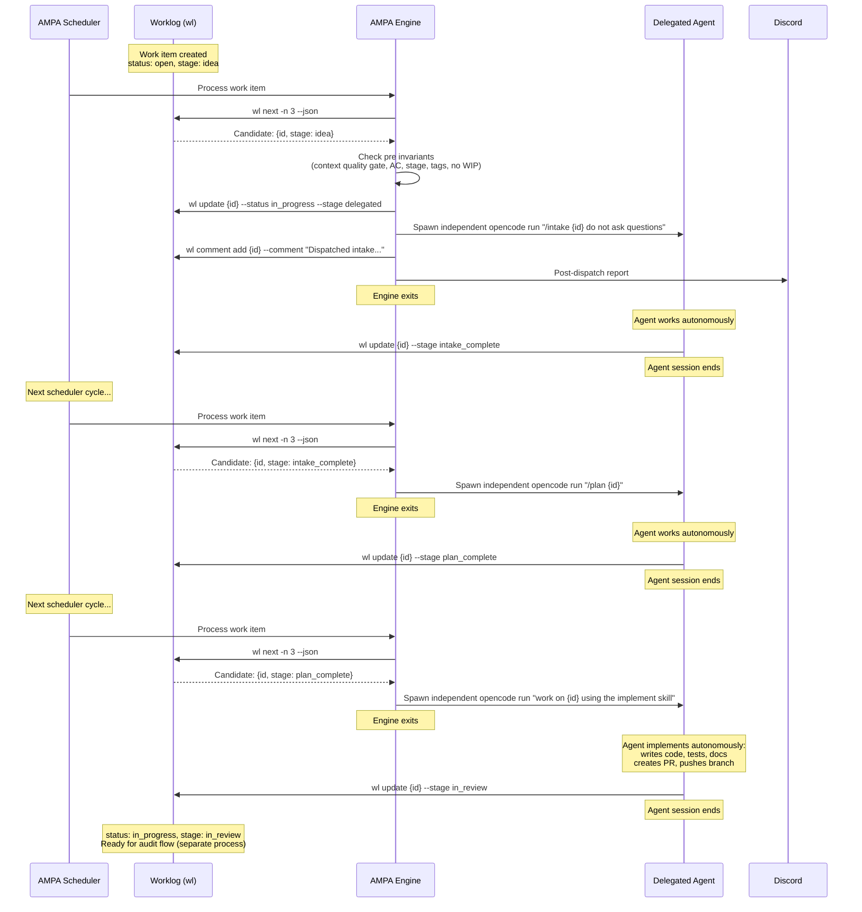
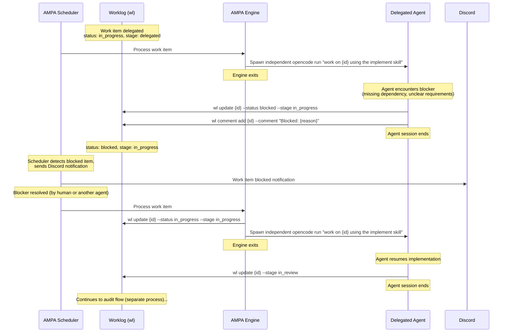

# AMPA Engine Execution Semantics & Delegation Lifecycle

## PRD — Product Requirements Document

| Field | Value |
|---|---|
| Work Item | SA-0MLT1ENFV0CTQ1IO |
| Parent | SA-0MLR5LBFP1IZ8VLL (Define AMPA delegation & management workflow) |
| Status | Draft |
| Author | opencode |
| Date | 2026-02-19 |
| Schema Ref | docs/workflow/workflow-schema.json, docs/workflow/workflow.yaml (SA-0MLT1ELCS16VDQV6) |

---

## 1. Introduction

This document describes how the AMPA engine consumes a workflow descriptor (as defined in `docs/workflow/workflow.yaml` / `docs/workflow/workflow.json`) to drive agent delegation and work item lifecycle management. The engine is a **one-off command** that processes a given work item according to the defined workflow — it is not a scheduler loop. The existing AMPA scheduler is responsible for deciding when to invoke the engine.

### 1.1 Delegation Pattern: Unidirectional, Fire-and-Forget

The AMPA engine uses a **unidirectional, fire-and-forget delegation** pattern:

1. **Engine selects** a work item via `wl next` and evaluates delegation preconditions.
2. **Engine delegates** the work item to an agent with full context (description, acceptance criteria, comments).
3. **Agent works autonomously** — no back-and-forth conversation with the engine.
4. **Agent completes independently** — the delegated session runs independently of the engine process. On completion, the agent updates the work item stage to reflect the outcome (e.g. `in_review` for implementation work). The engine does not wait for or receive a return from the agent.

The completion state set by the agent depends on its role:
- **Patch** (implementation): sets stage to `in_review`
- **PM** (intake/planning): sets stage to `intake_complete` or `plan_complete`
- Other roles update stage as appropriate to their function

This pattern avoids the complexity of both bidirectional conversation protocols and tightly-coupled process lifecycles. The agent has all required context from the work item and its comments at delegation time, and signals completion through work item state rather than process exit.

### 1.2 Scope

This PRD covers:
- How the engine loads and validates a workflow descriptor
- How commands are executed against work items
- How roles are resolved to concrete agents or humans
- The delegation lifecycle (select, delegate, dispatch independent agent session)
- Error handling and recovery for delegation
- Observability and audit trail for delegation

Out of scope:
- The workflow descriptor schema itself (covered in SA-0MLT1ELCS16VDQV6)
- Detailed delegation flow examples (covered in SA-0MLT1EPPK1HRBTPG)
- Test specifications (covered in SA-0MLT1ES320XPRCU8)
- **Post-delegation audit flow**: Auditing completed work items, interpreting audit results, auto-completion, audit cooldowns, and escalation based on audit outcomes are part of a separate audit flow (covered in SA-0MLWQI6DC09TF7IY). The audit flow picks up work items that have been set to `in_review` by a delegated agent and determines the next step independently of the engine.

---

## 2. Engine Architecture Overview

### 2.1 Components

```
+------------------+     +---------------------+     +------------------+
|                  |     |                     |     |                  |
|  Workflow        |---->|  AMPA Engine        |---->|  Work Item Store |
|  Descriptor      |     |  (one-off command)  |     |  (Worklog / wl)  |
|  (workflow.json) |     |                     |     |                  |
+------------------+     +----------+----------+     +------------------+
                                    |
                         +----------+----------+
                         |                     |
                    +----v----+          +-----v-----+
                    |  Agent  |          | Notification|
                    | Runtime |          |  System     |
                    | (opencode run)     | (Discord)   |
                    +---------+          +-----------+
```

The engine operates as a **one-off command** that processes a given work item according to the defined workflow. It is invoked by the AMPA scheduler (or manually) when a work item needs to be advanced. Each invocation:

1. Loads the workflow descriptor from `workflow.json`.
2. Queries the work item store (`wl`) for current state.
3. Determines which commands are available given the current state.
4. Executes the appropriate command by resolving actors to agents and dispatching an independent agent session.
5. Records the dispatch and audit details as work item comments.

The engine does not loop or poll — it performs a single delegation action and exits. The existing AMPA scheduler is responsible for periodically invoking the engine when work items need processing.

### 2.2 Workflow Descriptor Loading

The engine loads the workflow descriptor at startup and validates it against `docs/workflow/workflow-schema.json`. The descriptor provides:

- **Status and stage dimensions**: The valid values for work item `status` and `stage` fields.
- **State aliases**: Friendly names for `(status, stage)` tuples used in command definitions.
- **Commands**: Named actions with `from`/`to` state transitions, actor roles, invariants, inputs, and effects.
- **Invariants**: Named boolean rules checked before (`pre`) and after (`post`) command execution.
- **Roles**: Actor identifiers mapped to concrete agents or humans by the engine's actor resolution policy.

### 2.3 State Management

Work item state is the tuple `(status, stage)`. The engine does not maintain its own state store — it reads from and writes to the Worklog via `wl` CLI commands. This ensures the Worklog remains the single source of truth.

State transitions are atomic: `wl update <id> --status <new_status> --stage <new_stage>`.

---

## 3. Actor Resolution

### 3.1 Role-to-Actor Mapping

The workflow descriptor declares roles in `metadata.roles`. Each role has a `type` field indicating whether it is typically filled by a human, an agent, or either:

| Role | Type | Current Resolution |
|---|---|---|
| **Producer** | `human` | Human operator. Cannot be automated. Gates approval and escalation review. |
| **PM** | `either` | AMPA scheduler agent. Handles intake, planning, and delegation coordination. |
| **Patch** | `agent` | OpenCode agent spawned via `opencode run`. Implements delegated work autonomously. Session is independent of the engine. |
| **QA** | `agent` | Audit flow agent executing the `audit` skill. Verifies acceptance criteria. Out of engine scope (SA-0MLWQI6DC09TF7IY). |
| **DevOps** | `either` | CI/CD systems or human operators. Handles deployment and infrastructure. |
| **TechnicalWriter** | `either` | Agent or human. Produces documentation. |

### 3.2 Resolution Policy

When a command specifies `actor: <Role>`, the engine resolves the role as follows:

1. **Agent roles** (`Patch`, `QA`): The engine spawns an independent `opencode run` session with the appropriate skill/command. The agent is given full work item context and works autonomously. The engine does not wait for the session to complete.
2. **Human roles** (`Producer`): The engine sets `needs_producer_review: true` on the work item and sends a Discord notification. The engine exits; human action is asynchronous.
3. **Either roles** (`PM`, `DevOps`, `TechnicalWriter`): Resolved based on engine configuration. In the current AMPA implementation, `PM` is always the AMPA scheduler itself.

### 3.3 Assignment Policy

Per the workflow-language.md specification:

- When a work item enters a new state, the engine assigns the item per its controller policy.
- While a command runs, temporary ownership belongs to the command's `actor` role.
- On completion, the delegated agent is responsible for updating work item state and ownership.

In practice:
- Delegation (`delegate` command): assigns to the delegated agent role via `effects.set_assignee`.
- Escalation (`escalate`): assigns to `Producer` via `effects.set_assignee`.

---

## 4. Command Execution Lifecycle

Per workflow-language.md Section "Execution Semantics", the engine is responsible for the first 4 steps of command execution. Steps 5 and 6 are the responsibility of the delegated agent and the audit flow respectively.

### Step 1: Confirm From State

The engine reads the work item's current `(status, stage)` tuple and checks whether it matches any entry in the command's `from` list. If the tuple is expressed as a state alias, the engine resolves it via the `states` map.

**Failure behavior**: If the work item is not in a valid `from` state, the command is rejected. No state change occurs. The engine logs a warning.

### Step 2: Evaluate Pre Invariants

Each invariant name in the command's `pre` list is looked up in the `invariants` array and its `logic` expression is evaluated against the work item's current data (description, comments, tags, metadata).

**Failure behavior**: If any pre invariant fails, the command is aborted. No state change occurs. The engine records the failure as a work item comment and may notify via Discord.

### Step 3: Apply State Transition

On successful evaluation of pre invariants, the engine writes the dispatch state tuple to the work item. This sets the work item to its in-progress/delegated state — it does **not** set the completion state.

```
wl update <id> --status <to.status> --stage <to.stage>
```

### Step 4: Execute Command Logic

The engine resolves the `actor` role to a concrete agent or human and dispatches the command:

- **For agent actors**: Spawns an independent `opencode run` session with the appropriate command string (determined by stage-to-action mapping, see Section 5.2). The engine does not wait for the session to complete.
- **For human actors**: Sets flags on the work item and sends notifications. The engine does not wait for human action.

The engine records the dispatch in its audit trail and exits. The command logic itself is outside the workflow descriptor — it is the agent's autonomous work or the human's decision.

### Step 5: Evaluate Post Invariants (Agent Responsibility)

Post invariants are **not evaluated by the engine**. They are the responsibility of the delegated agent.

When the agent has completed its work, it must request a state transition by calling the engine. The engine evaluates the post invariants for the target transition against the updated work item state.

- **If post invariants pass**: The engine applies the requested state transition (e.g. `in_review`).
- **If post invariants fail**: The engine refuses the transition. The agent records the failure in a work item comment (including a summary of work completed) and awaits further instructions. The work item remains in its current state.

This ensures that agents cannot advance a work item to a completion state without meeting the required quality criteria.

### Step 6: Record Audit Comment (Audit Flow)

Recording structured audit comments (prompt hash, model, response IDs, etc.) is the responsibility of the audit flow (SA-0MLWQI6DC09TF7IY), not the engine. The engine records only dispatch-level information (command name, actor, timestamp, dispatch status) in its own audit trail.

### 4.1 Command-to-Engine Behavior Mapping

The following table maps each workflow command to its engine behavior. Commands marked *(audit flow)* are out of scope for the engine and are handled by the separate audit flow (SA-0MLWQI6DC09TF7IY).

| Command | Actor | Engine Action | Notes |
|---|---|---|---|
| `intake` | PM | Spawn independent `opencode run "/intake {id} do not ask questions"` | Agent sets stage to `intake_complete` on completion |
| `author_prd` | PM | PM drafts PRD, links to work item | Manual or AMPA-assisted |
| `plan` | PM | Spawn independent `opencode run "/plan {id}"` | Agent sets stage to `plan_complete` on completion |
| `start_build` | Patch | Developer picks up work manually | N/A (manual path) |
| `delegate` | PM | Spawn independent `opencode run "work on {id} using the implement skill"` | Agent sets stage to `in_review` on completion |
| `complete_work` | Patch | Agent updates work item stage (e.g. `in_review`) | Performed by delegated agent, not the engine |
| `block` | Patch | `wl update {id} --status blocked` | Agent or manual |
| `block_delegated` | Patch | `wl update {id} --status blocked --stage delegated` | Agent or manual |
| `unblock` | Patch | `wl update {id} --status in_progress` | Agent or manual |
| `unblock_delegated` | Patch | `wl update {id} --status in_progress --stage delegated` | Agent or manual |
| `submit_review` | Patch | Push branch, create PR | Agent workflow |
| `audit_result` | QA | *(audit flow)* `opencode run "/audit {id}"` -> passes | SA-0MLWQI6DC09TF7IY |
| `audit_fail` | QA | *(audit flow)* `opencode run "/audit {id}"` -> finds gaps | SA-0MLWQI6DC09TF7IY |
| `close_with_audit` | PM | *(audit flow)* `wl update {id} --status completed --stage in_review` | SA-0MLWQI6DC09TF7IY |
| `escalate` | PM | Set `needs_producer_review`, notify Discord | Manual escalation |
| `approve` | Producer | Human merges PR, confirms | Manual human step |
| `retry_delegation` | PM | Re-delegate after fixing gaps | Engine re-entry |
| `de_escalate` | Producer | Human resolves escalation | Manual human step |
| `reopen` | Producer | Re-plan closed item | Manual human step |

---

## 5. Delegation Lifecycle

### 5.1 Delegation Preconditions

Before the engine can execute the `delegate` command, all of the following must be true (matching the pre invariants defined in the schema):

1. **requires_work_item_context**: The PM agent runs a quality gate that audits the work item against the requirements for the target state transition. This is not a raw character count — it uses a prompt (from the audit skill) to evaluate whether the work item has sufficient context for the next step. The quality criteria vary by transition:
   - **idea → intake_complete**: Requires a clear description of the desired behavior change (user story or equivalent).
   - **intake_complete → plan_complete**: Requires a problem description, use cases, acceptance criteria, and implementation approach.
   - **plan_complete → delegated**: Requires acceptance criteria that are measurable and testable, plus sufficient context for autonomous implementation.
2. **requires_acceptance_criteria**: Description contains acceptance criteria (checkbox list or section header).
3. **requires_stage_for_delegation**: Work item stage is one of `idea`, `intake_complete`, or `plan_complete`.
4. **not_do_not_delegate**: Work item is not tagged `do-not-delegate` or `do_not_delegate`.
5. **no_in_progress_items**: No other work items have status `in_progress` (single-concurrency constraint).

Additionally, the engine checks (outside invariant system):
- `wl next` returns at least one candidate.
- Fallback mode is not `hold`.
- `audit_only` mode is not enabled.

### 5.2 Stage-to-Action Mapping

The possible state transitions — and therefore which actions are available for a given stage — are defined in the **workflow descriptor** (`workflow.yaml` / `workflow.json`), not hardcoded in the engine or this PRD. The engine reads the command definitions from the descriptor and determines which commands are valid for the work item's current `(status, stage)` tuple.

The current workflow descriptor defines the following delegation actions:

| Current Stage | Action | Shell Command |
|---|---|---|
| `idea` | `intake` | `opencode run "/intake {id} do not ask questions"` |
| `intake_complete` | `plan` | `opencode run "/plan {id}"` |
| `plan_complete` | `implement` | `opencode run "work on {id} using the implement skill"` |

If the workflow descriptor is updated with new stages or transitions, the engine will automatically support them without code changes.

The action label can be overridden by the fallback mode configuration:
- `auto-decline` → action becomes `decline`
- `auto-accept` → action becomes `accept`
- `hold` → delegation is skipped entirely

### 5.3 Delegation Dispatch

When all preconditions pass:

1. Engine selects the top candidate from `wl next -n 3`.
2. Engine determines the action from the stage-to-action mapping (see Section 5.2).
3. Engine applies the dispatch state transition to the work item. This sets the work item to its in-progress/delegated state — it does **not** set the completion state. The completion state is set by the agent upon finishing its work.
4. Engine spawns an independent `opencode run` session with the appropriate command. This session is **not** tied to the engine's process — the engine does not wait for it to complete.
5. Engine records the dispatch in its append-only audit trail (`store.append_dispatch`).
6. Engine sends a post-dispatch report via Discord.
7. Engine exits. The delegated agent session continues independently.

The delegated agent is responsible for updating the work item stage on completion (e.g. setting stage to `in_review` for implementation work). This stage update signals to downstream flows (such as the audit flow) that the work item is ready for further processing.

---

## 6. Error Handling

### 6.1 Pre-Invariant Failures

| Scenario | Engine Response |
|---|---|
| Pre invariant fails before delegation | Command rejected. Work item unchanged. Warning logged. Failure recorded via Discord notification. Candidate may be skipped in favor of next candidate. |
| Multiple pre invariants fail | All failures reported via Discord. Command not executed. |

### 6.2 Execution Errors

| Scenario | Engine Response |
|---|---|
| `opencode run` fails to spawn | Error captured. Work item left in current state. Dispatch record includes error details. Discord notification sent. |
| `wl update` fails | Retry once. If still fails, log error and abort transition. Work item left in prior state. |
| `wl next` returns no candidates | Engine exits with idle status. Discord notification: `"Agents are idle: no actionable items found"`. |
| `wl in_progress` check fails | Retry once. On double failure, abort delegation with error status. |

Note: Since the engine dispatches agent sessions independently and does not wait for completion, timeouts and agent process errors are not handled by the engine. The delegated agent is responsible for updating the work item state on failure (e.g. setting status to `blocked`).

---

## 7. Observability & Audit Trail

### 7.1 What Gets Recorded

For every command execution, the engine records a work item comment containing:

| Field | Source | Required |
|---|---|---|
| Command name | Workflow descriptor | Always |
| Actor role | Command `actor` field | Always |
| Resolved agent | Engine actor resolution | For agent roles |
| Timestamp | System clock | Always |
| Outcome | Success / failure (dispatch) | Always |
| Prompt hash | `effects.audit.record_prompt_hash` | For AI commands |
| Model | `effects.audit.record_model` | For AI commands |
| Response IDs | `effects.audit.record_response_ids` | For AI commands |
| Agent ID | `effects.audit.record_agent_id` | For AI commands |

### 7.2 Dispatch Audit Trail

The engine maintains an append-only dispatch log (last 100 records) in `store.append_dispatch` containing:

- Work item ID and title
- Action taken (intake, plan, implement, decline, accept)
- Timestamp
- Dispatch status (spawned / failed to spawn)
- Rejection reasons for skipped candidates

### 7.3 Discord Notifications

The engine sends structured notifications to Discord via webhook:

| Event | Channel Type | Content |
|---|---|---|
| Post-dispatch report | `command` | Delegation state overview and dispatch details |
| Idle state | `command` | `"Agents are idle: no actionable items found"` or rejected candidate details |

---

## 8. Sequence Diagrams

### 8.1 Happy Path: Idea to In-Review



### 8.2 Blocked Flow: Blocker During Implementation



---

## 9. Mapping: scheduler.py to Workflow Commands

This section traces the existing scheduler.py implementation to the formalized workflow commands as a reference for migration. Note that the engine is a new component distinct from the scheduler — the scheduler continues to exist and is responsible for deciding when to invoke the engine.

### 9.1 `_inspect_idle_delegation` → Pre-invariant Checks

| scheduler.py Check | Workflow Invariant | Command |
|---|---|---|
| `wl in_progress --json` returns empty | `no_in_progress_items` | `delegate` pre |
| `wl next -n 3` returns candidates | (Engine-level check, not invariant) | `delegate` precondition |
| Candidate stage in `[idea, intake_complete, plan_complete]` | `requires_stage_for_delegation` | `delegate` pre |
| `_is_do_not_delegate()` returns False | `not_do_not_delegate` | `delegate` pre |
| `fallback.resolve_mode()` != `hold` | (Engine-level check) | `delegate` precondition |

### 9.2 `_run_idle_delegation` → `delegate` Command

| scheduler.py Behavior | Workflow Mapping |
|---|---|
| Select candidate from `wl next -n 3` | Command input: `work_item_id` |
| Determine action from stage | Command input: `action` (intake/plan/implement) |
| Discord pre-dispatch notification | *(removed — only post-dispatch notification in engine)* |
| `opencode run "/intake {id}"` (stage=idea) | `delegate` command execution for idea state |
| `opencode run "/plan {id}"` (stage=intake_complete) | `delegate` command execution for intake state |
| `opencode run "work on {id} using the implement skill"` (stage=plan_complete) | `delegate` command execution for plan state |
| `store.append_dispatch(record)` | Dispatch audit trail |
| Post-dispatch Discord report | `effects.notifications` |

### 9.3 `_run_triage_audit` → Audit Flow (Out of Scope)

> **Note:** The `_run_triage_audit` logic maps to the audit flow (SA-0MLWQI6DC09TF7IY), not the engine. This mapping is preserved here for reference only.
>
> | scheduler.py Behavior | Workflow Mapping |
> |---|---|
> | `opencode run "/audit {id}"` | `audit_result` or `audit_fail` command execution |
> | Parse audit output for closure recommendation | `audit_recommends_closure` / `audit_does_not_recommend_closure` invariants |
> | Check for merged PR via `gh pr view` | Additional verification |
> | `wl update {id} --status completed --stage in_review` | `close_with_audit` command |
> | Post audit comment | Record audit comment |
> | Discord "Audit Completed" notification | `close_with_audit` effects.notifications |
> | Cooldown enforcement | Scheduling concern (not in workflow descriptor) |

---

## 10. Open Questions & Future Considerations

1. **Concurrent delegation**: The current engine enforces single-concurrency (one in-progress item at a time). Future versions may support parallel delegation with a configurable concurrency limit.

2. **Fallback modes**: The `auto-decline`, `auto-accept`, and `hold` modes are engine configuration, not workflow descriptor features. Consider whether these should be expressible as workflow-level guards.

3. **Sub-task delegation**: When a delegated work item has children, should the engine delegate children individually or delegate the parent and let the agent handle decomposition? Current behavior: Patch handles decomposition via the `implement` skill.

4. **Agent session monitoring**: Since the engine dispatches independent agent sessions without waiting, there is currently no mechanism for the engine to detect agent failures (crashes, hangs). Consider whether a monitoring/watchdog component is needed, or whether the scheduler should handle this by detecting stale `in_progress` items.

5. **Engine/scheduler boundary**: The engine is a one-off command invoked by the scheduler. The exact interface contract between scheduler and engine (CLI arguments, return codes, shared state) should be formalized.

---

## Appendix A: Role Classification

| Role | Type | AI-Driven | Human-Gated | Current Agent |
|---|---|---|---|---|
| Producer | human | No | **Yes** | Human operator |
| PM | either | **Yes** | No | AMPA scheduler |
| Patch | agent | **Yes** | No | OpenCode (opencode run) |
| QA | agent | **Yes** | No | Audit flow (SA-0MLWQI6DC09TF7IY) |
| DevOps | either | Partial | Partial | CI/CD + human |
| TechnicalWriter | either | **Yes** | No | OpenCode agent |

**Human-gated commands** (require `actor: Producer`):
- `approve`: Final approval before closure
- `reopen`: Reopen a closed item
- `de_escalate`: Resolve an escalation

**AI-driven commands — engine scope** (automated by engine):
- `intake`, `plan`, `delegate`, `complete_work`, `retry_delegation`
- `block`, `block_delegated`, `unblock`, `unblock_delegated`, `submit_review`

**AI-driven commands — audit flow** (SA-0MLWQI6DC09TF7IY):
- `audit_result`, `audit_fail`, `close_with_audit`

**Mixed commands**:
- `escalate`: Initiated by PM (AMPA) but requires Producer attention

---

## Appendix B: State Diagram Summary

```
                    +-------+
                    | idea  |  (open/idea)
                    +---+---+
                        |
                   intake|delegate
                        v
                  +---------+
                  | intake  |  (open/intake_complete)
                  +----+----+
                       |
                 author_prd
                       v
                  +--------+
                  |  prd   |  (open/prd_complete)
                  +----+---+
                       |
                    plan|
                       v
                  +--------+        delegate        +------------+
                  |  plan  | ---------------------> | delegated  |
                  +----+---+  (open/plan_complete)  +-----+------+
                       |                            (in_progress/delegated)
                  start_build                             |
                       |                          complete_work
                       v                                  |
                  +----------+  <-------------------------+
                  | building |  (in_progress/in_progress)
                  +----+-----+
                       |
                  submit_review
                       |
                       v
                  +---------+
                  | review  |  (in_progress/in_review)
                  +----+----+
                       |
              +--------+--------+
              |                 |
         audit_result       audit_fail
              |                 |
              v                 v
       +--------------+  +--------------+
       | audit_passed |  | audit_failed |
       +------+-------+  +------+-------+
              |                  |
       close_with_audit    escalate|retry
              |                  |
              v                  v
     +------------------+  +------------+
     | completed/review |  | escalated  |
     +--------+---------+  +-----+------+
              |                   |
           approve           de_escalate
              |                   |
              v                   v
        +----------+         +--------+
        | shipped  |         |  plan  |  (re-enter cycle)
        +----------+         +--------+
       (closed/done)
```
